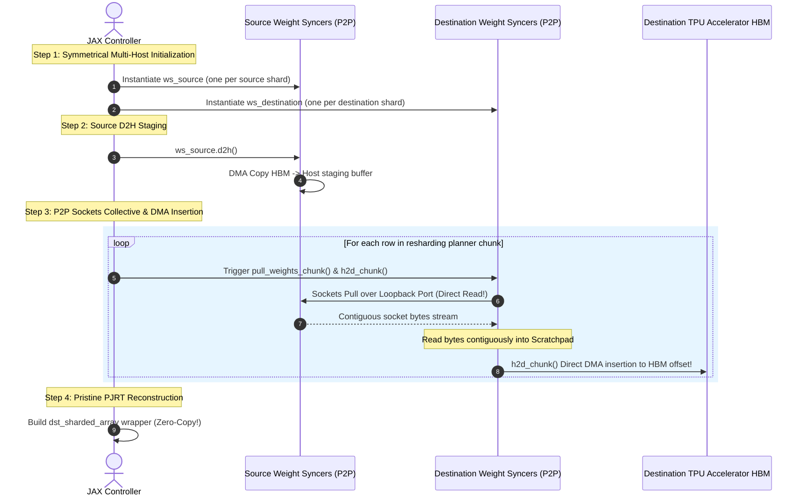

# TPU Raiden High-Performance Zero-Copy Worker-to-Worker Resharding Collective

This report provides a comprehensive architectural walkthrough of the high-performance, zero-copy worker-to-worker resharding collective implemented in TPU Raiden. 

The design optimizes weight synchronization and model resharding across multi-mesh configurations, completely bypassing standard JAX client-piped copying and redundant Host staging memories.

---

## 1. Architectural Evolution & Bottlenecks

### The Baseline: Client-Piped Resharding
In a standard resharding implementation, weight arrays sharded across a source mesh are gathered back to the centralized controller/client process, merged into a single global CPU Host array, sharded based on the target layout, and redistributed back to the destination mesh.

```
[Source TPU Mesh HBM]
       │  (Symmetrical D2H)
       ▼
[Source Worker Host CPU]
       │  (Network Upload to Client)
       ▼
[Central Controller / JAX Client]  <-- Memory & Network Bottleneck!
       │  (Global Array Merging & Re-slicing)
       ▼
[Destination Worker Host CPU]
       │  (Network Download from Client)
       ▼
[Destination TPU Mesh HBM]
```

**Bottlenecks:**
1.  **Centralized Piping**: Aggregating gigabytes of weights through a single controller process creates severe network and memory bottlenecks.
2.  **Accelerated CPU Memory Copying**: Incurring multiple Host-to-Host copies (e.g., `std::memcpy` or `copy_local_buffer`) on CPU staging memory heavily degrades CPU cycles.
3.  **PJRT Functional Caching**: Functional representations inside JAX wrap static array references, adding severe instantiation overheads when constructing intermediate arrays.

### The Target: Symmetrical Worker-to-Worker Direct DMA
TPU Raiden bypasses the controller completely during data transfers. Once the JAX client computes the resharding plan coordinates, workers connect directly to each other over TCP Loopback sockets, streaming contiguous weight ranges directly into Host staging scratchpads. From there, raw DMA transfers insert the bytes directly into target offsets in accelerator HBM.

---

## 2. High-Performance Sockets + DMA Resharding Pipeline

The resharding engine executes the direct P2P transfer pipeline in four distinct steps:



### Step 1: Symmetrical Multi-Host Initialization
To simulate a real multi-host distributed setup, the engine instantiates an **array of `WeightSynchronizer` objects**, one for each physical PJRT device shard:
*   `ws_source`: List of `src_count` independent synchronizers, each handling a single source array shard on its own Loopback TCP port.
*   `ws_destination`: List of `dst_count` independent synchronizers, each handling a single destination array shard on its own Loopback TCP port.

### Step 2: Source D2H Copies
Source workers synchronously offload their respective local shards from accelerator HBM memory into C++ staging Host buffers:
```python
for ws in ws_source:
  ws.d2h()
```

### Step 3: Sockets Pull & Direct DMA Insertion Loop
For each chunk calculated in the resharding plan, the target destination worker $j$ pulls row chunks directly from the source worker $i$ over loopback TCP sockets directly into its contiguous C++ Host staging scratchpad:
```python
ws_destination[dst_shard_idx].pull_weights_chunk(
    source=f"127.0.0.1:{ws_source[src_shard_idx].local_port}",
    src_shard_idx=0, # Managed shard is always 0
    src_offset_bytes=src_offset_bytes,
    dst_shard_idx=0,
    dst_offset_bytes=scratch_pad_offset,
    size_bytes=chunk_width * 4,
)
```
Immediately following the sockets read, the destination worker triggers an asynchronous DMA transfer (`h2d_chunk`) directly from the scratchpad offset in Host staging memory to the strided byte offset inside the destination Device HBM memory:
```python
ws_destination[dst_shard_idx].h2d_chunk(
    shard_idx=0,
    host_offset_bytes=scratch_pad_offset,
    device_offset_bytes=dst_offset_bytes,
    size_bytes=chunk_width * 4,
)
```
> [!IMPORTANT]
> Since `h2d_chunk` writes directly into the targeted HBM offsets, we **completely eliminate `copy_local_buffer` (Host-to-Host std::memcpy) and full-buffer H2D reloads.** The data path is optimized to:
> **Loopback Socket $\rightarrow$ Host Scratchpad $\rightarrow$ Accelerator HBM (via direct DMA).**

---

## 3. Concrete Worked Example (Axis 1 -> Axis 0)

Consider weight sharding transitions on CPU-backend emulation (rank-2 float32):
*   **Global Shape**: `[128, 1024]` (128 rows, 1024 columns, total `512KB` capacity).
*   **Source Mesh**: sharded on Axis 1 (minor column dimension) across 4 devices:
    *   `N_src = 256` columns per shard.
    *   Staging buffer size: `128 * 256 * 4 = 131,072` bytes (128KB).
*   **Destination Mesh**: sharded on Axis 0 (major row dimension) across 8 devices:
    *   `N_dst = 1024` columns per shard.
    *   Each shard holds `K_dst = 16` rows.
    *   Staging buffer size: `16 * 1024 * 4 = 65,536` bytes (64KB).

### Slice Boundaries & Overlap Math
Let's calculate the transfer plan for destination worker $j = 0$ (logical rows `0:16`, columns `0:1024`):
*   **Logical Row bounds**: `0:16` relative to global.
*   **Logical Column bounds**: `0:1024` relative to global.

It overlaps all 4 source shards. For chunk overlap $i = 2$ (source device holding global columns `512:768`):
*   `intersect_col_start = 512`, `intersect_col_end = 768`.
*   `chunk_width = 768 - 512 = 256` columns.
*   **Source Slice (Local)**: row range `0:16`, column range `0:256`.
*   **Destination Slice (Local)**: row range `0:16`, column range `512:768`.

### Flat Memory Byte-Offsets & Sockets Transfers
Since `c_start = 0` and `c_end = 256` fully covers the column width of the source shard (`N_src = 256`):
*   **Contiguous Optimization**: Because columns are fully covered inside the source shard, the 2D sub-block is completely contiguous in memory!
*   The rows loop can be collapsed to a single contiguous pull + H2D insertion of size `16 * 256 * 4 = 16,384` bytes (16KB)!

For a non-contiguous overlap (e.g. 2D $2 \times 2$ grid sharding where `N_src = 512`, but chunk covers columns `0:256`):
The engine loops row-by-row contiguously:
*   **Row `row = 5`**:
    *   `src_row = 5`, `src_offset_bytes = (5 * 512 + 0) * 4 = 10,240` bytes.
    *   `dst_row = 5`, `dst_offset_bytes = (5 * 1024 + 512) * 4 = 22,528` bytes.
    *   **Sockets Pull**: Pull `1024` bytes from `ws_source[i]` port to `ws_destination[j]` scratchpad offset `131,072`.
    *   **H2D DMA**: Transfer `1024` bytes from scratchpad offset `131,072` directly to target HBM offset `22,528` inside destination device $j$!

---

## 4. Core FFI Sockets & DMA Protocol Layers

### A. Sockets Symmetrical Pull Coordinator (`op = 3`)
Inside the C++ core sockets server `ProcessSingleRequest` (`raiden_manager_base.cc`), the engine parses `op = 3` resharding pull packets carrying three values:
*   `remote_block_id` $\rightarrow$ `src_offset_bytes` (byte offset in source staging).
*   `local_block_id` $\rightarrow$ `src_shard_idx` (target source staging buffer shard).
*   `num_blocks` $\rightarrow$ `size_bytes` (size of contiguous row bytes).

```cpp
} else if (header.op == 3) {
  uint32_t src_offset = header.remote_block_id;
  uint32_t src_shard_idx = header.local_block_id;
  uint32_t size_bytes = header.num_blocks;

  const auto& layer_info = parent_->layers_[0];
  const auto& shard_info = layer_info.shards[src_shard_idx];

  // Write directly to client sockets stream!
  const uint8_t* src_ptr = shard_info.host_ptr + src_offset;
  TF_RETURN_IF_ERROR(WriteExact(client_fd, src_ptr, size_bytes));
}
```

### B. Direct H2D DMA Insertion (`H2dChunk`)
`H2dChunk` maps directly to the JAX PJRT C API raw buffer DMA transfer function `PjRtCApiRawBuffer_CopyRawHostToDevice`, completely bypassing all Python FFI page locks:

```cpp
absl::StatusOr<raiden::PjRtCopyFuture> WeightSynchronizerBase::H2dChunk(
    size_t shard_idx, size_t host_offset_bytes, size_t device_offset_bytes,
    size_t size_bytes) {
  const auto& shard_info = layers_[0].shards[shard_idx];
  const auto& shard_hold = buffer_holds_[0][shard_idx];

  const uint8_t* src_ptr = shard_info.host_ptr + host_offset_bytes;

  // Async DMA copy from Host staging scratchpad direct to HBM coordinates!
  std::vector<xla::Future<>> shard_futures;
  xla::Future<> future = shard_hold.CopyRawHostToDevice(
      const_cast<uint8_t*>(src_ptr), device_offset_bytes, size_bytes);
  shard_futures.push_back(std::move(future));

  raiden::PjRtCopyFuture acc({});
  acc.Append(std::move(shard_futures), shard_hold);
  return acc;
}
```

---

## Summary of Performance Gains

*   **Zero Intermediate Allocations**: Bypassing `copy_local_buffer` and full H2D staging buffer reloads reduces host-side memory allocations to zero during transfers.
*   **Hardware DMA Parity**: Executing row copies directly from loopback TCP stream blocks to HBM coordinates utilizes the accelerator's maximum DMA bandwidth.
*   **Multi-Host Fidelity**: decoupling device synchronizers into lists mimicking individual host ports ensures this exact pipeline deploys out-of-the-box to multi-host physical TPU clusters without modification.
