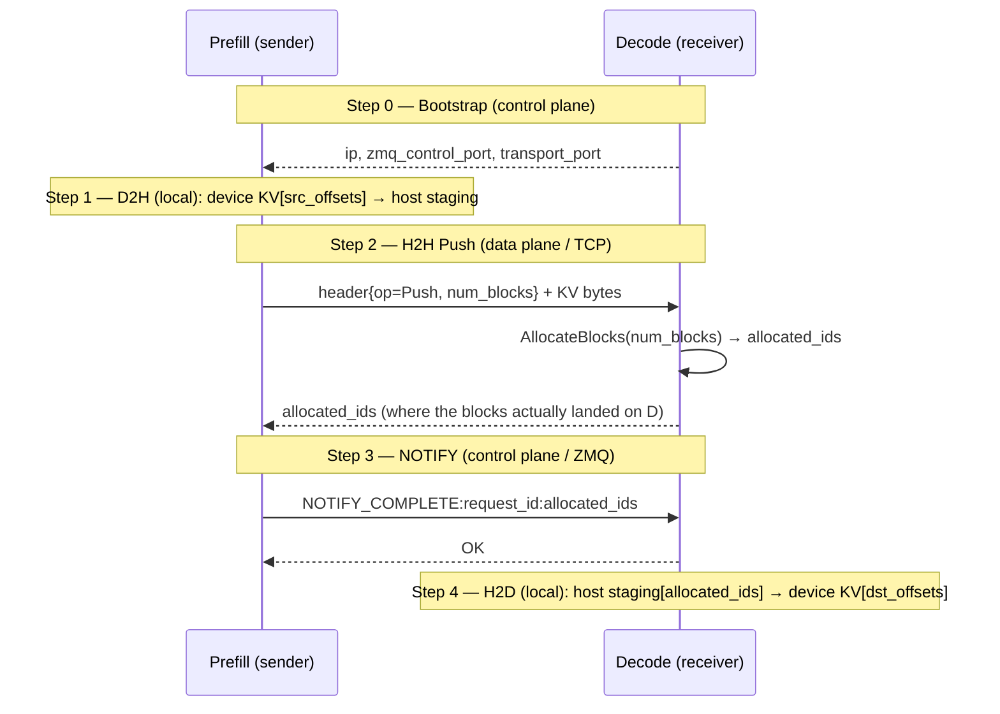
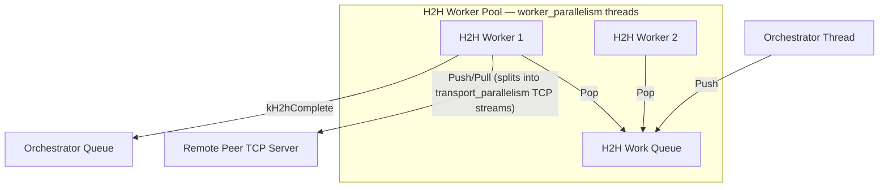

# JAX Disaggregated KV Cache Manager: E2E Implementation Report

This document provides a comprehensive walkthrough of the newly implemented `DisaggKVCacheManager` and its E2E verification. The manager orchestrates paged KV cache transfers between **Prefill** (sender) and **Decode** (receiver) JAX engines over high-speed TCP transport with ZeroMQ-based coordination.

---

## 1. Coordination Architecture

The `DisaggKVCacheManager` is built on a decoupled C++ multi-threaded coordination core (`DisaggKVCacheManagerBase`) exposed to Python/JAX via Nanobind.

```mermaid
graph TD
    subgraph C++ Base Layer (DisaggKVCacheManagerBase)
        Orchestrator[Orchestrator Thread] -- kExternalRequest --> LocalQueue[Local Work Queue]
        Orchestrator -- kExternalRequest --> H2hQueue[H2H Work Queue]
        
        LocalThread[Local Transfer Thread] -- Pop --> LocalQueue
        LocalThread -- Blocking Await --> PJRT[(PJRT CPU/TPU Engine)]
        LocalThread -- Push kLocalComplete --> OrchQueue[Orchestrator Queue]
        
        H2hThread[H2H Block Transfer Thread] -- Pop --> H2hQueue
        H2hThread -- Push Blocks --> PeerTransport[Peer BlockTransport Server]
        H2hThread -- Push kH2hComplete --> OrchQueue
        
        ZmqListener[ZMQ Listener Thread] -- Recv NOTIFY_COMPLETE --> OrchQueue
        ZmqListener -- Send ZMQ Reply --> PeerClient[Peer ZMQ Client]
        
        Orchestrator -- Pop Event --> OrchQueue
    end

    subgraph JAX Bindings Layer (Nanobind)
        JAX[JAX Python Client] -- SubmitRequest --> Orchestrator
        Orchestrator -- GIL-Safe InvokeCallback --> JAX_Callback[Python Callback]
    end
```

---

## 2. Touched Codebase Artifacts

The following files were created and integrated into the `tpu_raiden` workspace:

| File | Type | Description |
| :--- | :--- | :--- |
| [disagg_kv_cache_manager_base.h](file:///google/src/cloud/jcgu/raiden_disagg/google3/third_party/tpu_raiden/kv_cache/disagg_kv_cache_manager_base.h) | `C++ Header` | Core class declaration, defining thread-safe event queues, coordinate structures, and thread loops. |
| [disagg_kv_cache_manager_base.cc](file:///google/src/cloud/jcgu/raiden_disagg/google3/third_party/tpu_raiden/kv_cache/disagg_kv_cache_manager_base.cc) | `C++ Source` | Implementation of Orchestrator, Local PJRT copy loop, H2H socket loop, ZMQ listener, and manual bootstrap registry. |
| [disagg_kv_cache_manager.h](file:///google/src/cloud/jcgu/raiden_disagg/google3/third_party/tpu_raiden/api/jax/disagg_kv_cache_manager.h) | `C++ Header` | JAX subclass exposing sharded Python list unpack constructor. |
| [disagg_kv_cache_manager.cc](file:///google/src/cloud/jcgu/raiden_disagg/google3/third_party/tpu_raiden/api/jax/disagg_kv_cache_manager.cc) | `C++ Source` | Unpacks physical JAX device arrays and implements GIL-protected callback execution. |
| [kv_cache_manager_module.cc](file:///google/src/cloud/jcgu/raiden_disagg/google3/third_party/tpu_raiden/api/jax/kv_cache_manager_module.cc) | `C++ Source` | Exposes Nanobind definitions for disaggregated structures and releases Python GIL on `Stop()`. |
| [disagg_kv_cache_manager.py](file:///google/src/cloud/jcgu/raiden_disagg/google3/third_party/tpu_raiden/api/jax/disagg_kv_cache_manager.py) | `Python` | High-level Python wrapper class for JAX integration. |
| [disagg_kv_cache_manager_test.py](file:///google/src/cloud/jcgu/raiden_disagg/google3/third_party/tpu_raiden/api/jax/disagg_kv_cache_manager_test.py) | `Python` | E2E parameterized unit test verifying CPU PJRT copies and ZMQ coordination. |
| [kv_cache_manager_base.h](file:///google/src/cloud/jcgu/raiden_disagg/google3/third_party/tpu_raiden/kv_cache/kv_cache_manager_base.h) | `C++ Header` | Made H2d and D2h virtual to support mock subclassing. |
| [disagg_kv_cache_manager_base_test.cc](file:///google/src/cloud/jcgu/raiden_disagg/google3/third_party/tpu_raiden/kv_cache/disagg_kv_cache_manager_base_test.cc) | `C++ Source` | gUnit test verifying C++ coordination flow under mocked PJRT copies and local TCP transport. |
| [BUILD (kv_cache)](file:///google/src/cloud/jcgu/raiden_disagg/google3/third_party/tpu_raiden/kv_cache/BUILD) | `Starlark` | Builds the base library and registers the C++ base unit test. |
| [BUILD (api/jax)](file:///google/src/cloud/jcgu/raiden_disagg/google3/third_party/tpu_raiden/api/jax/BUILD) | `Starlark` | Builds the JAX binding shared object and registers the Python E2E test. |

---

## 3. E2E Test Verification Results

The test executes 4 parameterized test cases (`BF16`, `FP32`, `FP8`, and `INT32`) verifying a zero-copy D2H -> H2H Push -> ZMQ Notify -> H2D workflow.

### Execution Command
```bash
blaze test //third_party/tpu_raiden/api/jax:disagg_kv_cache_manager_test_cpu \
  --test_output=streamed --nocheck_visibility
```

### Pass Log Outputs
```
[ RUN      ] DisaggKVCacheManagerTest.test_e2e_disagg_push_bf16
I0528 00:22:52.140122 disagg_kv_cache_manager_base.cc:75] DisaggKVCacheManagerBase started. ZMQ port: 38967
I0528 00:22:52.141700 disagg_kv_cache_manager_base.cc:75] DisaggKVCacheManagerBase started. ZMQ port: 45837
I0528 00:22:52.242185 disagg_kv_cache_manager_base.cc:130] Manually registered peer: decode at 127.0.0.1 (ZMQ:45837, Transport:44107)
I0528 00:22:52.242488 disagg_kv_cache_manager_base.cc:109] [Orchestrator] Submitting request 1001 (type: 1)
I0528 00:22:52.242612 disagg_kv_cache_manager_base.cc:109] [Orchestrator] Submitting request 1001 (type: 0)
I0528 00:22:52.242935 disagg_kv_cache_manager_base.cc:201] [Orchestrator] Request 1001: Triggering Prefill D2H
I0528 00:22:52.244017 disagg_kv_cache_manager_base.cc:192] [Orchestrator] Popped event type: 1 for request 1001
I0528 00:22:52.244127 disagg_kv_cache_manager_base.cc:235] [Orchestrator] Request 1001: Local transfer completed with status: OK
I0528 00:22:52.244177 disagg_kv_cache_manager_base.cc:243] [Orchestrator] Request 1001: D2H complete, triggering H2H Write
I0528 00:22:52.249105 disagg_kv_cache_manager_base.cc:272] [Orchestrator] Request 1001: H2H transfer completed with status: OK
I0528 00:22:52.249170 disagg_kv_cache_manager_base.cc:280] [Orchestrator] Request 1001: H2H Write complete, sending ZMQ notification to decode
I0528 00:22:52.249223 disagg_kv_cache_manager_base.cc:138] [ZMQ Client] Sending message to peer decode at tcp://127.0.0.1:45837: NOTIFY_COMPLETE:1001:0,1
I0528 00:22:52.250468 disagg_kv_cache_manager_base.cc:450] Received ZMQ control message: NOTIFY_COMPLETE:1001:0,1
I0528 00:22:52.250618 disagg_kv_cache_manager_base.cc:169] [ZMQ Server] Sending reply: OK
I0528 00:22:52.250871 disagg_kv_cache_manager_base.cc:308] [Orchestrator] Received peer notification for request 1001 with block IDs: 0, 1
I0528 00:22:52.250996 disagg_kv_cache_manager_base.cc:317] [Orchestrator] Request 1001: Target offsets already present. Triggering H2D.
I0528 00:22:52.251134 disagg_kv_cache_manager_base.cc:295] [Orchestrator] ZMQ notification successfully sent and acked by decode
I0528 00:22:52.253120 disagg_kv_cache_manager_base.cc:235] [Orchestrator] Request 1001: Local transfer completed with status: OK
I0528 00:22:52.253164 disagg_kv_cache_manager_base.cc:251] [Orchestrator] Request 1001: H2D complete, request fully done!
I0528 00:22:52.353319 disagg_kv_cache_manager_base.cc:75] [Stop] Stop() started
I0528 00:22:52.353477 disagg_kv_cache_manager_base.cc:416] [H2H] H2hTransferLoop exiting
I0528 00:22:52.353484 disagg_kv_cache_manager_base.cc:374] [Local] LocalTransferLoop exiting
I0528 00:22:52.353506 disagg_kv_cache_manager_base.cc:339] [Orchestrator] OrchestrationLoop exiting
I0528 00:22:52.441127 disagg_kv_cache_manager_base.cc:522] [ZMQ Server] ListenerLoop exiting
I0528 00:22:52.441971 disagg_kv_cache_manager_base.cc:106] [Stop] Resetting zmq_listener_socket_...
I0528 00:22:52.442189 disagg_kv_cache_manager_base.cc:109] DisaggKVCacheManagerBase stopped.
[       OK ] DisaggKVCacheManagerTest.test_e2e_disagg_push_bf16
...
Executed 1 out of 1 test: 1 test passes.
INFO: Build completed successfully, 5 total actions
//third_party/tpu_raiden/api/jax:disagg_kv_cache_manager_test_cpu        PASSED in 33.3s
```

---

## 4. Prefill ↔ Decode Workflow & Information Exchange

This section traces a single KV transfer end-to-end and marks **exactly which information each side needs locally, and which pieces cross the wire**. The goal: a reader should be able to see what the prefill must know, what the decode must know, and what they hand each other to complete one transfer.

Two independent network channels connect the engines:

| Channel | Transport | Endpoint port | Carries |
| :--- | :--- | :--- | :--- |
| **Control plane** | ZeroMQ `REQ`/`REP` | `zmq_control_port()` | small text messages: peer registration, `NOTIFY_COMPLETE` |
| **Data plane** | TCP `BlockTransport` | `local_port()` (a.k.a. `transport_port`) | the KV block **bytes** + the block-id handshake |

### What each side submits

| Side | Request | Fields it must supply | Meaning of the offsets |
| :--- | :--- | :--- | :--- |
| **Prefill** (sender) | `PREFILL_D2H` | `request_id`, `src_offsets`, `dst_offsets`, `sizes`, `peer` | `src_offsets`: device major-dim offsets of the KV to send. `dst_offsets`: prefill-**local host staging** offsets. `peer`: decode's registered name. |
| **Decode** (receiver) | `DECODE_H2D` | `request_id`, `dst_offsets`, `sizes` | `dst_offsets`: device major-dim offsets where the received KV must land. |

> `request_id` is the **shared key**: both sides must use the *same* id so the decode can match an incoming `NOTIFY_COMPLETE` to the `DECODE_H2D` it queued. Offsets/sizes are in **major-dimension slice units**; a "block" is `block_size` consecutive slices, so a block id `b` covers major slices `[b*block_size, (b+1)*block_size)`.

### Sequence (with information exchanged at each step)



**Step 0 — Bootstrap / peer discovery (control plane).**
Prefill must learn decode's `{ip, zmq_control_port, transport_port}` — via `register_peer(...)`, the `CONNECT_REQ:<name>:<ip>:<zmq>:<transport>` handshake, or an external discovery proxy.
*Crosses the wire:* decode's `ip`, `zmq_control_port`, `transport_port`. Afterwards prefill can reach decode on **both** planes; for a push the decode needs to know **nothing** about the prefill.

**Step 1 — Prefill D2H (local, nothing on the wire).**
Device KV at `src_offsets` is copied into the prefill's host staging buffer. The staging block ids are derived locally as `dst_offsets / block_size`.

**Step 2 — H2H Push (data plane).**
Prefill opens `parallelism` TCP streams to decode's `transport_port` and pushes the staged blocks.
- *Prefill → Decode:* `BlockPacketHeader{op=Push, num_blocks}`, then the raw KV bytes for every `layer × shard`, for each block.
- *Decode → Prefill:* the **receiver-allocated block ids**. Decode's `LogicalBlockManager` allocates `num_blocks` free blocks in **its own** host staging buffer, returns their ids, then writes the incoming bytes into exactly those blocks.
- ⚠️ **Who owns the block ids:** the **decode** decides where blocks land, not the prefill. The prefill receives these ids as the push's return value. They are generally **not** equal to the prefill's local staging ids — they coincide only when the decode happens to allocate sequentially (e.g. a fresh pool at `parallelism=1`).

**Step 3 — NOTIFY_COMPLETE (control plane).**
After every push stream is acknowledged, prefill notifies decode.
- *Prefill → Decode:* `NOTIFY_COMPLETE:<request_id>:<block_ids>`, where `<block_ids>` is the **receiver-allocated ids returned in Step 2** (comma-separated).
- *Decode → Prefill:* `OK`.
- This is the message that tells the decode **which of its own staging blocks** now hold this request's KV.

**Step 4 — Decode H2D (local, nothing on the wire).**
Decode matches `request_id` to the pending `DECODE_H2D`, and for each notified block id computes `src_offset = block_id * block_size` (host staging), pairs it **positionally** with the request's `dst_offsets[i]`, and copies host staging → device KV.

### Information ownership summary

| Information | Produced by | Needed by | How it gets there |
| :--- | :--- | :--- | :--- |
| decode `ip` / `zmq_control_port` / `transport_port` | Decode | Prefill | bootstrap (Step 0) |
| `src_offsets`, prefill staging ids | Prefill | Prefill (local) | from `PREFILL_D2H` |
| KV **bytes** | Prefill | Decode | H2H push (Step 2) |
| **receiver-allocated block ids** | **Decode** | Prefill, then **back to Decode** | data-plane return (Step 2) → `NOTIFY` (Step 3) |
| `dst_offsets`, `sizes` | Decode | Decode (local) | from `DECODE_H2D` |

The non-obvious flow is the **block-id round-trip**: the ids originate on the *decode*, travel *back* to the prefill on the data plane, and must be *echoed forward* to the decode in the `NOTIFY`. Sending anything else here silently corrupts the transfer under concurrency — see [§5 "Receiver Block-Identity in NOTIFY"](#receiver-block-identity-in-notify-parallelism1-corruption).

---

## 5. Critical Fixes & Technical Deep Dive

### ZMQ Context Destructor Deadlock
*   **Problem**: Under standard ZeroMQ coordination, `Stop()` blocks on `zmq_context_.reset()`. In ZMQ, `zmq_ctx_destroy()` blocks indefinitely until *all* associated socket instances (including short-lived REQ sockets used for client messaging) are closed. If background socket deallocations lag, the test hangs during exit.
*   **Solution**:
    1.  **Immediate Linger Suppression**: Set `ZMQ_LINGER = 0` on *all* REP and REQ sockets right after instantiation. This instructs the OS to discard lingering message buffers immediately during stack unwinds instead of lingering in a blocked background state.
    2.  **Leaked Global Context Pattern**: Implemented an anonymous helper `GetGlobalZmqContext()` in the base manager source:
        ```cpp
        namespace {
        zmq::context_t& GetGlobalZmqContext() {
          static auto* context = new zmq::context_t(1);
          return *context;
        }
        }
        ```
        This leaked static context outlives the lifetime of any individual manager, guaranteeing that `Stop()` only needs to safely reset `zmq_listener_socket_` without ever invoking blocked context destruction.

### Python GIL Deadlock on Stop()
*   **Problem**: The Python main thread calls `prefill_manager.stop()`, acquiring the C++ `Stop()` lock and blocking on `std::thread::join()`. When the C++ background threads (e.g., `OrchestrationLoop`) stack unwind, their local variables (containing `std::function` Python callback wrappers) are destroyed. Decrementing the Python refcounts requires the GIL. Since the main thread is blocking on the join *holding* the GIL, they deadlock.
*   **Solution**: Expose `stop` in the Nanobind bindings with an explicit **GIL Release Call-Guard**:
    ```cpp
    .def("stop", &tpu_raiden::kv_cache::DisaggKVCacheManagerBase::Stop,
         nb::call_guard<nb::gil_scoped_release>())
    ```
    This releases the Python GIL immediately upon entering C++ `Stop()`, allowing the background threads to safely acquire the GIL when stack unwinding and destroying callback references, unblocking the thread join.

### Receiver Block-Identity in NOTIFY (parallelism>1 corruption)
*   **Problem**: KV silently corrupted whenever multiple blocks were transferred concurrently (`parallelism > 1`, or several in-flight requests). The orchestrator's `kH2hComplete` handler built the `NOTIFY_COMPLETE` payload from `active_requests[req_id].block_ids`, which still held the prefill's **local staging** ids (`dst_offsets / block_size`). But per §4 (Step 2 — H2H Push), the ids that matter are the **receiver-allocated** ids returned by the push — they were stored on the *event's* request copy and ignored. The decode then computed its H2D `src_offsets` from the wrong ids and read the wrong staging blocks. At `parallelism=1` the decode's `LogicalBlockManager` allocates sequentially, so staging ids `[0,1]` happened to equal the allocated ids `[0,1]` and it worked **by coincidence**; at `parallelism>1` the decode could allocate `[1,0]`, the stale `[0,1]` was sent, and the two blocks were swapped — verified via send/recv/H2D fingerprint logging (data was placed correctly in host blocks, but the `block_ids` reaching H2D were `[0,1]` when they should have been `[1,0]`).
*   **Solution**: In the `kH2HWrite` branch of `OrchestrationLoop`, refresh the canonical request with the ids the push actually allocated **before** composing the notification:
    ```cpp
    // event.request carries the block_ids the receiver allocated for this push;
    // active_requests still holds our local staging ids.
    req.block_ids = event.request.block_ids;
    std::string msg = absl::StrCat("NOTIFY_COMPLETE:", req.request_id, ":");
    ```
*   **Companion fix (data race)**: `LogicalBlockManager` is not thread-safe, yet the transport's receiver `ConnectionWorker` threads call `AllocateBlocks` concurrently (one per inbound stream) while the orchestrator `Unlock`s completed blocks. Two concurrent `Allocate()` calls could hand out the **same** free block. Added an `absl::Mutex block_manager_mutex_` (in `kv_cache_manager_base.h`) guarding the `AllocateBlocks` override and the orchestrator's `Unlock`.
*   **Regression coverage**: `disagg_kv_cache_manager_test.py::test_e2e_disagg_push_multi_request_concurrent` (runs at `parallelism=2`) reproduces the corruption and now passes; verified end-to-end across two TPU hosts up to 8 requests / `parallelism=4`.

---

## 6. Optimized Non-Blocking Coordination Design

To transition both **Local transfers (PJRT)** and **Host-to-Host transfers (TCP)** from blocking execution to high-performance concurrent pipelining, we have designed two zero-overhead non-blocking collection patterns:

### A. Local PJRT transfers: Event-Driven Callback (`future.OnReady`)

Instead of spawning a background polling thread to check `IsReady()` (which wastes CPU and introduces latency), we leverage PJRT's native `OnReady` callback API.

```mermaid
graph TD
    Orchestrator[Orchestrator Thread] -- kExternalRequest --> LocalQueue[Local Work Queue]
    LocalThread[Local Transfer Thread] -- Pop --> LocalQueue
    LocalThread -- Issue Async Copy --> PJRT[(PJRT Engine)]
    LocalThread -- Register OnReady Callback -- PJRT Thread Pool --> PJRT
    PJRT -- On Completion -- kLocalComplete --> Orchestrator
```

1.  **Non-blocking Local Thread**: The `LocalTransferLoop` thread dispatches `D2h` or `H2d` asynchronously, receives the `PjRtCopyFuture`, and immediately registers a lambda callback before looping back to pop the next copy request:
    ```cpp
    future_or.value().OnReady([this, req](absl::Status status) {
      orchestrator_queue_.Push({Event::Type::kLocalComplete, req.request_id, status, req, {}, ""});
    });
    ```
2.  **Zero-Overhead Execution**: The lambda callback is executed automatically by XLA/PJRT's internal driver thread pool the microsecond the hardware DMA completes, pushing the event directly to the Orchestrator.
3.  **Benefits**: Zero custom background threads, zero CPU polling cycles, and sub-microsecond coordination latency.

---

### B. Host-to-Host transfers: Two independent parallelism knobs

`BlockTransport::Push`/`Pull` are blocking, so H2H concurrency is scaled with **two separately-named, independently-tunable** configs. Conflating them (a single `parallelism`) previously masked the bug in [§5](#receiver-block-identity-in-notify-parallelism1-corruption), so they are now distinct:

| Config (Python kwarg) | C++ member | Scope | Controls |
| :--- | :--- | :--- | :--- |
| `worker_parallelism` | `DisaggKVCacheManagerBase::worker_parallelism_` | **request-level** | number of `H2hTransferLoop` threads draining `h2h_work_queue_` → how many H2H transfers run **concurrently** |
| `transport_parallelism` | `RaidenManagerBase::transport_parallelism_` | **transfer-level** | the `parallelism` argument to `BlockTransport::Push`/`Pull` → how many **TCP streams** a *single* transfer is striped across |

The two compose: with `worker_parallelism=W` and `transport_parallelism=T`, up to `W` transfers run at once and each fans out over `T` sockets, so up to `W*T` concurrent TCP streams.



1.  **Worker pool (`worker_parallelism`)**: `Start()` spins up `worker_parallelism_` threads running `H2hTransferLoop`, all concurrently popping the thread-safe `h2h_work_queue_`:
    ```cpp
    for (int i = 0; i < worker_parallelism_; ++i) {
      h2h_transfer_threads_.push_back(
          std::thread(&DisaggKVCacheManagerBase::H2hTransferLoop, this));
    }
    ```
2.  **Per-transfer streams (`transport_parallelism`)**: each worker calls `H2hWriteDirect`/`H2hReadDirect`, which pass `transport_parallelism_` to `BlockTransport::Push`/`Pull`. `Push` splits the request's blocks across that many `H2hWriteWorker` streams (each its own socket), and the receiver accepts one `ConnectionWorker` per stream.
3.  **Concurrency safety**: because multiple streams/requests now allocate receiver blocks concurrently, the `LogicalBlockManager` is guarded by `block_manager_mutex_`, and the completion path notifies the peer with the **receiver-allocated** block ids (see [§5](#receiver-block-identity-in-notify-parallelism1-corruption)).

