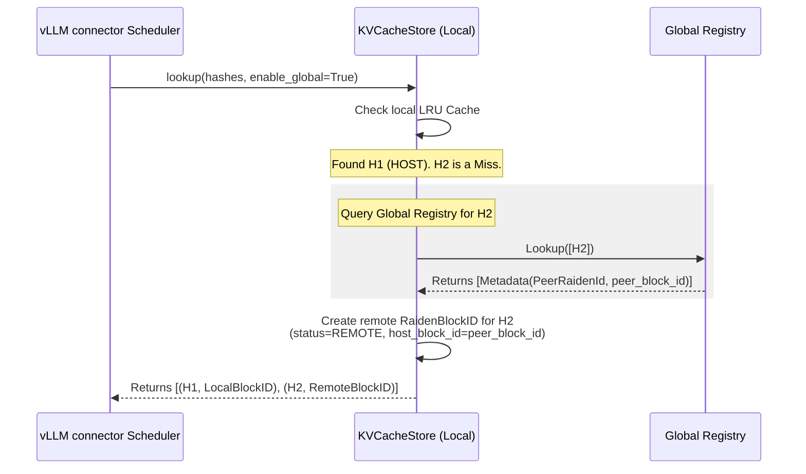
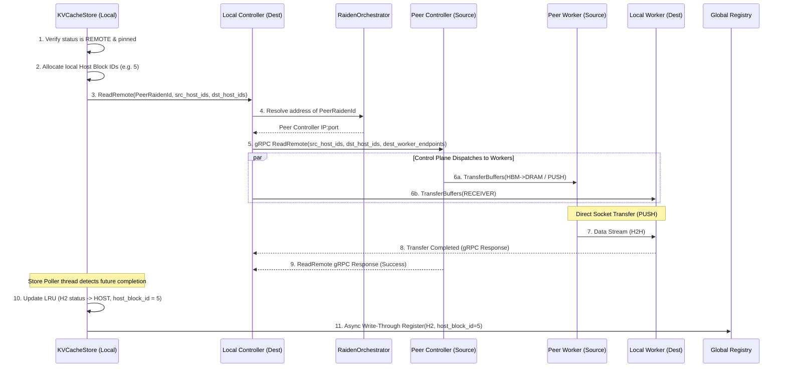
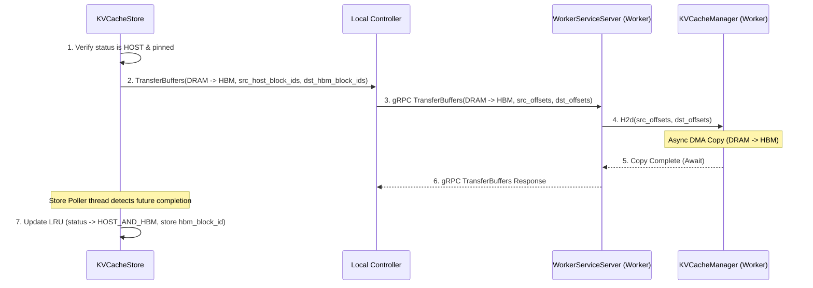
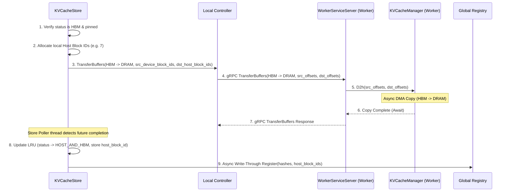
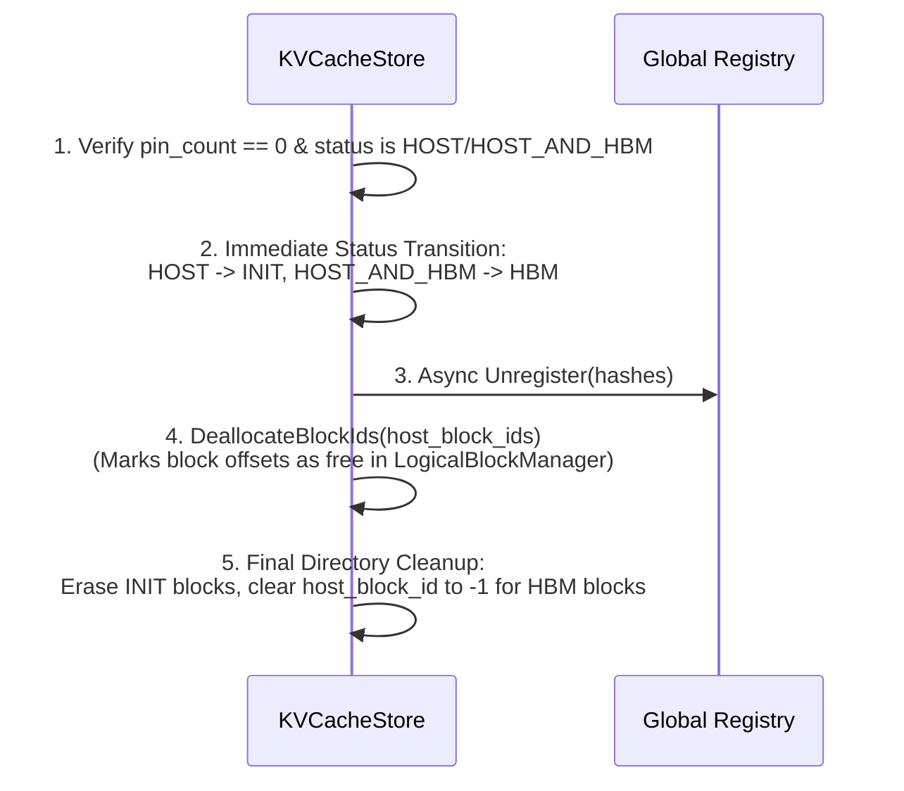

# Global Prefix Caching in TPU Raiden
This document details the architectural design, component layering, communication protocols, Python APIs, and E2E workflows for the **Global Prefix Caching** feature in TPU Raiden.
---
## 1. Overview & Functionality
In distributed LLM serving, a request might be routed to a node that lacks the required Key-Value (KV) cache prefix in its local memory, even though another serving node has already computed and cached it.
**Global Prefix Caching** solves this by allowing nodes to share KV cache blocks globally. When a local cache miss occurs, the node queries a centralized directory to locate the prefix on remote peers. If found, it fetches the blocks directly over the network via Host-to-Host (H2H) transfer, bypassing redundant prefill computation on the TPU.
---
## 2. Architecture & Component Layering
The architecture cleanly decouples the logical directory management (control plane) from physical buffer allocation and network transfers (data plane). All control plane interactions are driven by gRPC, while data plane transfers utilize optimized local copies (PJRT) or raw TCP socket streams (PUSH mode).
```mermaid
graph TB
    subgraph GLOBAL_ORCH ["GLOBAL ORCHESTRATOR LAYER"]
        Registry["Global Registry<br>(gRPC GlobalRegistryService)"]:::control
        Registry ~~~ Orchestrator
        Orchestrator["RaidenOrchestrator<br>(gRPC OrchestratorService)"]:::control
    end
    subgraph ENGINE_0 ["ENGINE 0"]
        direction TB
        subgraph E0_CP ["ENGINE 0 CONTROL PLANE (inside vLLM connector scheduler)"]
            subgraph E0_Ctrl ["vLLM connector scheduler"]
                subgraph Store0_box ["KVCacheStore"]
                    Store0_LRU["Local LRU Directory"]:::control
                    Ctrl0["RaidenController<br>(gRPC RaidenControllerService)"]:::control
                end
            end
        end
        subgraph E0_DP ["ENGINE 0 DATA PLANE (vLLM connector worker)"]
            subgraph E0_W0 ["vLLM connector worker 0"]
                subgraph Daemon0_0_box ["WorkerServiceServer (gRPC)"]
                    Daemon0_0["gRPC Handlers"]:::control
                    Manager0_0["KVCacheManager<br>(DRAM Pool)"]:::control
                end
            end
            subgraph E0_W1 ["vLLM connector worker 1"]
                subgraph Daemon0_1_box ["WorkerServiceServer (gRPC)"]
                    Daemon0_1["gRPC Handlers"]:::control
                    Manager0_1["KVCacheManager<br>(DRAM Pool)"]:::control
                end
            end
        end
        E0_CP ===> E0_DP
    end
    subgraph ENGINE_1 ["ENGINE 1"]
        direction TB
        subgraph E1_CP ["ENGINE 1 CONTROL PLANE (inside vLLM connector scheduler)"]
            subgraph E1_Ctrl ["vLLM connector scheduler"]
                subgraph Store1_box ["KVCacheStore"]
                    Store1_LRU["Local LRU Directory"]:::control
                    Ctrl1["RaidenController<br>(gRPC RaidenControllerService)"]:::control
                end
            end
        end
        subgraph E1_DP ["ENGINE 1 DATA PLANE (vLLM connector worker)"]
            subgraph E1_W0 ["vLLM connector worker 0"]
                subgraph Daemon1_0_box ["WorkerServiceServer (gRPC)"]
                    Daemon1_0["gRPC Handlers"]:::control
                    Manager1_0["KVCacheManager<br>(DRAM Pool)"]:::control
                end
            end
            subgraph E1_W1 ["vLLM connector worker 1"]
                subgraph Daemon1_1_box ["WorkerServiceServer (gRPC)"]
                    Daemon1_1["gRPC Handlers"]:::control
                    Manager1_1["KVCacheManager<br>(DRAM Pool)"]:::control
                end
            end
        end
        E1_CP ===> E1_DP
    end
    %% Global Connections
    Store0_LRU -.->|gRPC| Registry
    Store1_LRU -.->|gRPC| Registry
    Ctrl0 -.->|gRPC| Orchestrator
    Ctrl1 -.->|gRPC| Orchestrator
    %% Ownership: RaidenController is owned and managed by KVCacheStore
    %% Local Control Plane to Data Plane gRPC Connections
    Ctrl0 ===>|gRPC (WorkerServiceClient)| Daemon0_0
    Ctrl0 ===>|gRPC (WorkerServiceClient)| Daemon0_1
    Ctrl1 ===>|gRPC (WorkerServiceClient)| Daemon1_0
    Ctrl1 ===>|gRPC (WorkerServiceClient)| Daemon1_1
    %% Cross-Engine H2H Data Connection
    Manager0_1 <===>|H2H Socket TCP (PUSH)| Manager1_0
    %% Cross-Engine Control Plane Negotiation
    Ctrl0 <===>|gRPC ReadRemote| Ctrl1
    classDef global fill:#f5f5f5,stroke:#333,stroke-width:1px;
    classDef control fill:#e1f5fe,stroke:#0288d1,stroke-width:1px;
    classDef data fill:#efebe9,stroke:#5d4037,stroke-width:1px;
    style E0_W0 fill:#fff,stroke:#7f8c8d,stroke-dasharray: 5 5;
    style E0_W1 fill:#fff,stroke:#7f8c8d,stroke-dasharray: 5 5;
    style E1_W0 fill:#fff,stroke:#7f8c8d,stroke-dasharray: 5 5;
    style E1_W1 fill:#fff,stroke:#7f8c8d,stroke-dasharray: 5 5;
    style Daemon0_0_box fill:#e1f5fe,stroke:#0288d1,stroke-width:3px;
    style Daemon0_1_box fill:#e1f5fe,stroke:#0288d1,stroke-width:3px;
    style Daemon1_0_box fill:#e1f5fe,stroke:#0288d1,stroke-width:3px;
    style Daemon1_1_box fill:#e1f5fe,stroke:#0288d1,stroke-width:3px;
    style Store0_box fill:#e1f5fe,stroke:#0288d1,stroke-width:3px;
    style Store1_box fill:#e1f5fe,stroke:#0288d1,stroke-width:3px;
```
### Component Details
1.  **`KVCacheStore` (Logical Directory)**:
    *   **Layer**: Engine Control Plane (inside vLLM connector scheduler) (Engine 0 / Engine 1).
    *   **Role**: Manages the logical metadata of KV cache blocks. It uses an internal `LruCache` to map block hashes (strings) to `RaidenBlockID` descriptors. It tracks block status (e.g., `REMOTE`, `HOST`, `HBM`) and refcounted pins to protect active blocks from eviction.
    *   **Communication**: Invokes methods on `RaidenController` asynchronously, obtaining operation handles. It tracks active operations in internal maps and polls them for completion in a background `PollerLoop` thread. Updates the `GlobalRegistry` via an internal thread pool upon completed `Save` or `ReadRemote` operations.
2.  **`RaidenController` (Control Plane Coordinator)**:
    *   **Layer**: Engine Control Plane (inside vLLM connector scheduler) (Engine 0 / Engine 1).
    *   **Role**: As a part of `KVCacheStore`, it exposes the `RaidenControllerService` gRPC endpoint. Coordinates local worker daemons and negotiates remote reads with other engines.
    *   **Communication**:
        *   **Orchestrator**: Resolves logical `RaidenId`s to controller service addresses via `OrchestratorService` gRPC. The controller can also execute some proactive operations (e.g., prefetch remote KV) sent from Orchestrator, but this feature hasn't been done yet.
        *   **Remote Controllers**: Negotiates and triggers remote reads using the `RaidenControllerService::ReadRemote` gRPC.
        *   **Local Workers**: Dispatches buffer allocation and data transfer operations to worker daemons using `WorkerService` gRPC.
3.  **`WorkerServiceServer` (Data Plane Worker Daemon)**:
    *   **Layer**: Engine Data Plane (vLLM connector worker) (Engine 0 / Engine 1).
    *   **Role**: A gRPC daemon (`WorkerServiceServer`) running on each worker process (one per NUMA node in JAX). It listens for physical buffer commands from the local controller and drives the execution engine.
    *   **Communication**: Exposes `CreateBuffers`, `DeleteBuffers`, and `TransferBuffers` RPCs. It executes memory copies via PJRT or streams data directly to peer sockets.
4.  **`KVCacheManager` (Data Plane Execution)**:
    *   **Layer**: Engine Data Plane (vLLM connector worker) (Engine 0 / Engine 1).
    *   **Role**: `KVCacheManager` performs the actual data transfers: Host-to-Host (H2H) over sockets, and Host-to-Device (H2D) / Device-to-Host (D2H) via PJRT.
    *   **Communication**: Streams data directly to remote peer workers over TCP sockets during H2H transfers (PUSH mode).
5.  **`GlobalRegistry`**:
    *   **Layer**: Global Orchestrator Layer.
    *   **Role**: A centralized gRPC service (`GlobalRegistryService`) that maps prefix hashes to `KVBlockMetadata` (which includes the owning `RaidenId` and its physical block ID on that host). It supports multiple owners and returns them in a round-robin fashion for load balancing.
6.  **`RaidenOrchestrator`**:
    *   **Layer**: Global Orchestrator Layer.
    *   **Role**: A lightweight gRPC service (`OrchestratorService`) that maps logical `RaidenId`s to physical IP:port controller addresses. It acts as the routing table for peer discovery. Please also note, Orchestrator is capable of triggering proactive KV cache transfer operations (e.g., prefetch) without going through the control plane of inference engine.
---
## 3. Python APIs & Timeline Workflows
### Python API Surface
The bindings are exposed in `google3.third_party.tpu_raiden.tpu_raiden.api.jax.kv_cache_store` (Note: JAX version):
#### `BlockStatus` (Enum)
Represents the physical location and state of a cached block:
*   `INIT = 0`: Empty / Unallocated block.
*   `REMOTE = 1`: Discovered on a remote peer node (not local).
*   `HBM = 2`: Allocated and pinned solely in TPU HBM.
*   `HOST = 3`: Allocated in local Host DRAM (eligible for LRU eviction).
*   `HOST_AND_HBM = 4`: Synced in both Host DRAM and TPU HBM.
#### `RaidenBlockID` (Class)
Tracks physical coordinates and state for a cached block:
*   `property raiden_id: RaidenId` — The owning engine identifier.
*   `property host_block_id: int` — The host DRAM block offset index (local or remote peer).
*   `property device_block_id: int` — The local TPU HBM device block ID.
*   `property status: BlockStatus` — The active memory location status of the block.
#### `KVCacheStore` (Class)
*   `__init__(capacity: int, global_registry_address: str = "", raiden_id: RaidenId = None, num_shards: int = 0, shard_size_bytes: int = 0, raiden_controller_port: int = 0, raiden_orchestrator_address: str = "")`
    *   **Description**: Initializes the `KVCacheStore` logical directory, starts the background poller thread, and initializes the local controller.
    *   **Inputs**:
        *   `capacity`: Total logical blocks this directory can manage.
        *   `global_registry_address`: GPRC endpoint for the centralized directory.
        *   `raiden_id`: The local engine's work unit identifier.
        *   `num_shards`: Number of local TPU chips.
        *   `shard_size_bytes`: Byte size of a single shard block.
        *   `raiden_controller_port`: Listening port for the background controller.
        *   `raiden_orchestrator_address`: Orchestrator gRPC address for resolving peer IPs.
    *   **Returns**: None.
*   `lookup(block_hashes: list[bytes], enable_global: bool = False) -> list[tuple[bytes, RaidenBlockID]]`
    *   **Description**: Checks the directory for block hashes. Performs a global registry lookup for any misses if `enable_global` is True.
    *   **Inputs**:
        *   `block_hashes`: List of binary prefix hashes to locate.
        *   `enable_global`: Fall back to querying the global registry on a local cache miss.
    *   **Returns**: List of `(hash, RaidenBlockID)` tuples. Halts and returns immediately upon the first complete miss (neither local nor global).
*   `insert(block_hashes: list[bytes], slices: list[RaidenBlockID], on_host: bool) -> tuple[bool, list[tuple[bytes, RaidenBlockID]]]`
    *   **Description**: Caches block metadata manually. Evicts older unpinned blocks if capacity is exceeded.
    *   **Inputs**:
        *   `block_hashes`: Hashes to insert.
        *   `slices`: Associated `RaidenBlockID` block descriptors.
        *   `on_host`: True if the backing buffers reside in Host DRAM.
    *   **Returns**: A tuple of `(all_inserted, evicted_entries)`, where `all_inserted` is True if all keys are new, and `evicted_entries` contains evicted `(hash, RaidenBlockID)` items.
*   `insert_and_lock(block_hashes: list[bytes], slices: list[RaidenBlockID], on_host: bool) -> bool`
    *   **Description**: Inserts block hashes and pins them in a single atomic transaction. Prevents eviction while in use by active attention prefill queries.
    *   **Inputs**:
        *   `block_hashes`: Hashes to insert and lock.
        *   `slices`: Associated `RaidenBlockID` descriptors.
        *   `on_host`: True if located in Host DRAM.
    *   **Returns**: True if the entire batch succeeded (all items locked, or inserted and locked).
*   `release_and_delete(block_hashes: list[bytes]) -> int`
    *   **Description**: Releases/unpins block hashes. If a block's status is `REMOTE` and its pin count drops to 0, it is deleted from the directory.
    *   **Inputs**:
        *   `block_hashes`: Hashes to unpin.
    *   **Returns**: The number of remote blocks deleted.
*   `pin(block_hashes: list[bytes]) -> bool`
    *   **Description**: Manually pins existing block hashes, protecting them from LRU eviction.
    *   **Inputs**:
        *   `block_hashes`: Hashes to pin.
    *   **Returns**: True if all hashes exist in the directory and were successfully pinned.
*   `release(block_hashes: list[bytes]) -> None`
    *   **Description**: Releases previously pinned block hashes, making them eligible for LRU eviction.
    *   **Inputs**:
        *   `block_hashes`: Hashes to release.
    *   **Returns**: None.
*   `save(block_hashes: list[bytes]) -> bool`
    *   **Description**: Launches an asynchronous Device-to-Host (D2H) copy from TPU HBM to local Host DRAM. Blocks must be locked before calling `save`.
    *   **Inputs**:
        *   `block_hashes`: Pinned HBM block hashes to save.
    *   **Returns**: True if the async copy was successfully dispatched.
*   `load(block_hashes: list[bytes], device_block_ids: list[int]) -> bool`
    *   **Description**: Launches an asynchronous Host-to-Device (H2D) copy from local Host DRAM to TPU HBM. Blocks must be pinned before calling `load`.
    *   **Inputs**:
        *   `block_hashes`: Pinned DRAM block hashes to load.
        *   `device_block_ids`: Destination TPU block IDs.
    *   **Returns**: True if the async copy was successfully dispatched.
*   `poll_save_status() -> tuple[list[bytes], list[bytes], list[bytes]]`
    *   **Description**: Polls active async `save` operations.
    *   **Returns**: A tuple of `(done_hashes, failed_hashes, pending_hashes)`. Completed items are transitioned to `HOST_AND_HBM` status in the LRU, and registered in the `GlobalRegistry`.
*   `poll_load_status() -> tuple[list[bytes], list[bytes], list[bytes]]`
    *   **Description**: Polls active async `load` operations.
    *   **Returns**: A tuple of `(done_hashes, failed_hashes, pending_hashes)`. Completed items are transitioned to `HOST_AND_HBM` status in the LRU.
*   `read_remote(block_hashes: list[bytes]) -> bool`
    *   **Description**: Launches an asynchronous Host-to-Host (H2H) network copy to read remote blocks from peer nodes into local host DRAM.
    *   **Inputs**:
        *   `block_hashes`: Remote block hashes (status `REMOTE`) to fetch.
    *   **Returns**: True if the async network copy was successfully dispatched.
*   `poll_remote_read_status() -> tuple[list[bytes], list[bytes], list[bytes]]`
    *   **Description**: Polls active async H2H remote reads.
    *   **Returns**: A tuple of `(done_hashes, failed_hashes, pending_hashes)`. Completed items are transitioned to `HOST` status in the LRU (associated with their allocated local host block IDs) and registered in the `GlobalRegistry`.
---
### Timeline Workflows
#### A. Lookup (Global Fallback)
Checks local cache and automatically queries the global registry on a local miss.

#### B. ReadRemote (H2H Network Copy)
Pulls a remote block from a peer node into local DRAM staging memory.

#### C. Load (H2D Copy)
Copies blocks locally from host DRAM to TPU HBM before execution.

#### D. Save (D2H Copy & Registry Registration)
Offloads blocks from TPU HBM to Host DRAM and registers them globally.

#### E. Evict (DRAM Cleanup & Registry Unregistration)
Frees Host DRAM space by unlocking blocks and removing global directory entries.

No newline at end of right file.