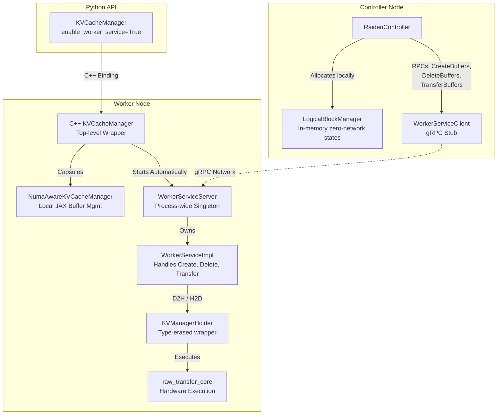

# Raiden Controller and Worker Architecture

Based on Justin Lu's recent CLs (including pending CL 946005421), the Raiden Controller architecture separates the control plane (memory logic) from the data plane (physical buffer management and transfer execution). 

## Component Layering

Below is a Mermaid diagram detailing how the C++ and Python classes layer to form the Controller and Worker nodes over gRPC.

## 1. The Controller Plane (`RaidenController`)

The **Raiden Controller** orchestrates logical block allocations globally.

- **`RaidenController` (CL 944877718, 946005421):**
  - Encapsulates a `LogicalBlockManager` (tracking what memory block holds what) and a `WorkerServiceClient` (communicating with remote workers).
  - Pre-allocates all necessary physical allocations on the worker node upfront during initialization using the `CreateBuffers` RPC.
  - Because all bulk allocations are established upfront, runtime `Allocate` and `Deallocate` methods operate purely in-memory via the `LogicalBlockManager` resulting in **zero network overhead**.
  - Exposes the `TransferBuffers` API (with explicit `src_mem_type` and `dst_mem_type`) to initiate memory transfers manually.

- **`RaidenControllerService` (CL 945540246):**
  - Exposes a protobuf service with a `RegisterWorker` RPC, allowing remote workers to formally announce their presence/endpoints to the Raiden Controller upon booting.

## 2. The Worker Service (Listener)

The Worker Service runs locally on the individual compute nodes holding the KV caches. Its goal is to handle actual physical memory allocations and movements on behalf of the central controller.

- **Process-Wide Integration and Initialization (CL 944870406, 945813245, 946005421):**
  - The worker server runs as a process-wide singleton (`WorkerServiceServer`).
  - In JAX, the former `KVCacheManager` was renamed to `NumaAwareKVCacheManager`. 
  - A new top-level `KVCacheManager` wrapper encapsulates `NumaAwareKVCacheManager` and exposes an **`enable_worker_service` flag** (configurable from Python). Setting this to `True` automatically starts the gRPC server locally.

- **`WorkerService` gRPC Implementation (CL 944793435, 945962714):** 
  - **`CreateBuffers` & `DeleteBuffers`**: Allocates/frees sharded memory buffers and relates them over the wire via opaque `BufferHandle` integers.
  - **`WorkerServiceImpl`**: Stores the allocated physical shards in an `absl::flat_hash_map` keyed by `BufferHandle` natively.
  - **`TransferBuffers`**: A dedicated method for executing Device-to-Host (D2H) and Host-to-Device (H2D) memory transfers across memory spaces on the worker natively.

- **Hardware Execution (`KVManagerHolder`)**: 
  - `WorkerServiceImpl` delegates the execution of `D2H` and `H2D` data transfers to a `KVManagerHolder`. This type-erased wrapper executes the hardware-level commands underneath via `raw_transfer_core`.
