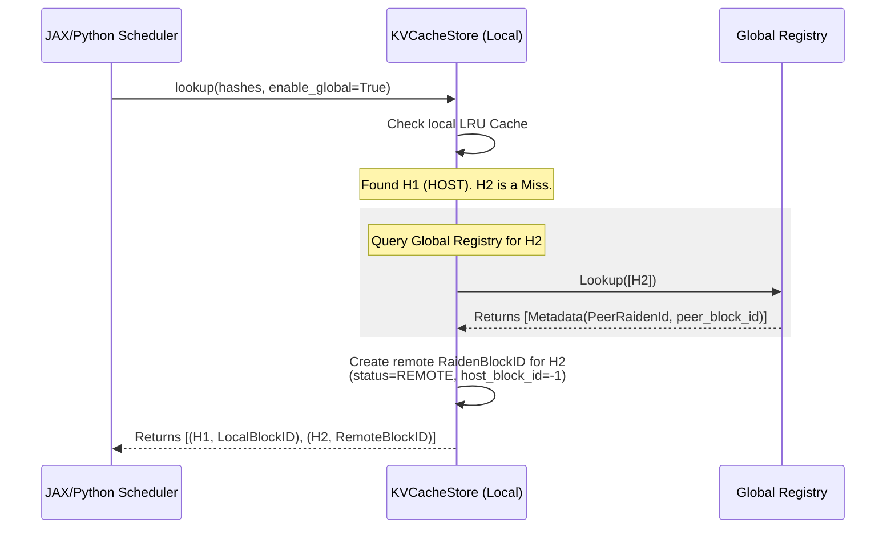
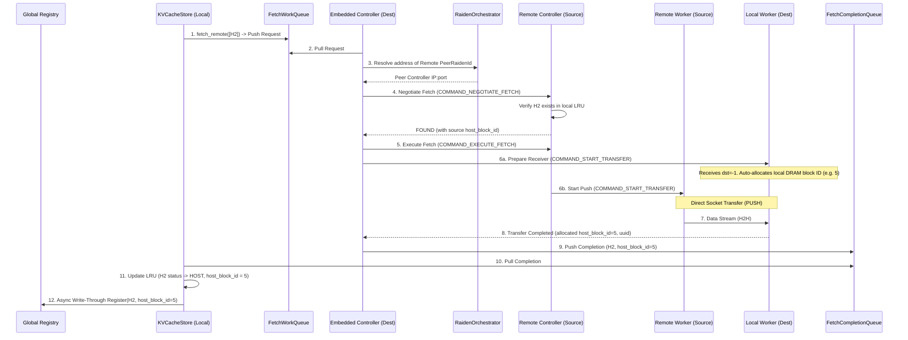
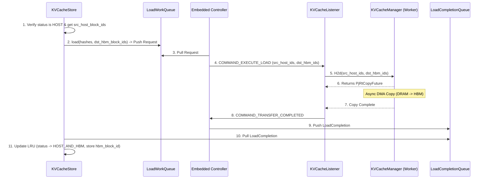
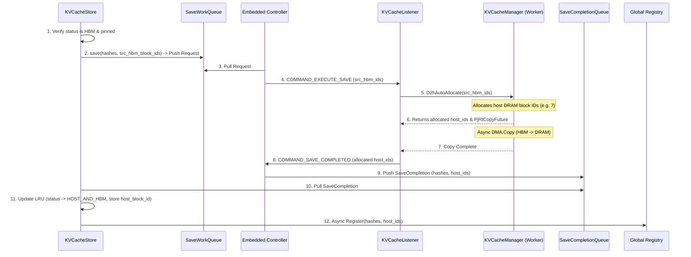
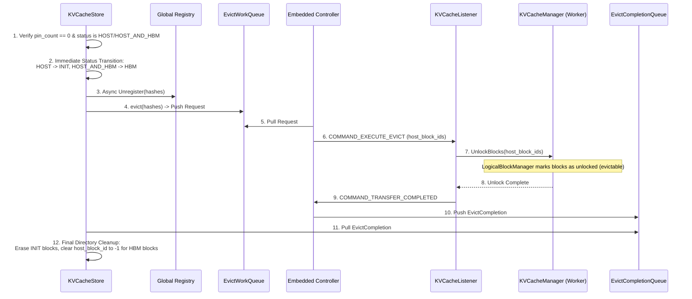

# Global Prefix Caching in TPU Raiden

This document details the architectural design, component layering, communication protocols, Python APIs, and E2E workflows for the **Global Prefix Caching** feature in TPU Raiden.

---

## 1. Overview & Functionality

In distributed LLM serving, a request might be routed to a node that lacks the required Key-Value (KV) cache prefix in its local memory, even though another serving node has already computed and cached it. 

**Global Prefix Caching** solves this by allowing nodes to share KV cache blocks globally. When a local cache miss occurs, the node queries a centralized directory to locate the prefix on remote peers. If found, it fetches the blocks directly over the network via Host-to-Host (H2H) transfer, bypassing redundant prefill computation on the TPU.

---

## 2. Architecture & Component Layering

The architecture cleanly decouples the logical directory management (control plane) from physical buffer allocation and network transfers (data plane).

```mermaid
graph TB
    subgraph GLOBAL_ORCH ["GLOBAL ORCHESTRATOR LAYER"]
        Registry["Global Registry<br>(gRPC Global Directory)"]:::global
        Registry ~~~ Orchestrator
        Orchestrator["RaidenOrchestrator<br>(Logical -> Physical Routing)"]:::global
    end

    subgraph ENGINE_0 ["ENGINE 0"]
        direction TB
        subgraph E0_CP ["ENGINE 0 CONTROL PLANE"]
            subgraph E0_Ctrl ["Controller (Same Process)"]
                Store0["KVCacheStore (JAX)<br>(Logical LRU Directory)"]:::control
                Ctrl0["RaidenController<br>(Background Coordinator)"]:::control
            end
        end
        subgraph E0_DP ["ENGINE 0 DATA PLANE"]
            subgraph E0_W0 ["Worker 0"]
                subgraph Listener0_0 ["KVCacheListener (Daemon)"]
                    Manager0_0["KVCacheManager<br>(DMA & DRAM Pool)"]:::data
                end
            end
            subgraph E0_W1 ["Worker 1"]
                subgraph Listener0_1 ["KVCacheListener (Daemon)"]
                    Manager0_1["KVCacheManager<br>(DMA & DRAM Pool)"]:::data
                end
            end
        end
        E0_CP ===> E0_DP
    end

    subgraph ENGINE_1 ["ENGINE 1"]
        direction TB
        subgraph E1_CP ["ENGINE 1 CONTROL PLANE"]
            subgraph E1_Ctrl ["Controller (Same Process)"]
                Store1["KVCacheStore (JAX)<br>(Logical LRU Directory)"]:::control
                Ctrl1["RaidenController<br>(Background Coordinator)"]:::control
            end
        end
        subgraph E1_DP ["ENGINE 1 DATA PLANE"]
            subgraph E1_W0 ["Worker 0"]
                subgraph Listener1_0 ["KVCacheListener (Daemon)"]
                    Manager1_0["KVCacheManager<br>(DMA & DRAM Pool)"]:::data
                end
            end
            subgraph E1_W1 ["Worker 1"]
                subgraph Listener1_1 ["KVCacheListener (Daemon)"]
                    Manager1_1["KVCacheManager<br>(DMA & DRAM Pool)"]:::data
                end
            end
        end
        E1_CP ===> E1_DP
    end

    %% Global Connections
    Store0 -.->|gRPC| Registry
    Store1 -.->|gRPC| Registry
    Ctrl0 -.->|Custom TCP| Orchestrator
    Ctrl1 -.->|Custom TCP| Orchestrator

    %% Force Parallel Engine Layout
    Store0 ~~~ Store1

    %% Local Process Queue Connections
    Store0 <===>|In-Memory Queues| Ctrl0
    Store1 <===>|In-Memory Queues| Ctrl1

    %% Local Control Plane to Data Plane Listener Connections
    Ctrl0 ===>|Custom TCP (Control)| Manager0_0
    Ctrl0 ===>|Custom TCP (Control)| Manager0_1
    Ctrl1 ===>|Custom TCP (Control)| Manager1_0
    Ctrl1 ===>|Custom TCP (Control)| Manager1_1

    %% Cross-Engine H2H Data Connection
    Manager0_1 <===>|H2H TCP| Manager1_0

    %% Cross-Engine Control Plane Negotiation
    Ctrl0 <===>|Transfer Negotiation (TCP)| Ctrl1

    classDef global fill:#f5f5f5,stroke:#333,stroke-width:1px;
    classDef control fill:#e1f5fe,stroke:#0288d1,stroke-width:1px;
    classDef data fill:#efebe9,stroke:#5d4037,stroke-width:1px;

    style E0_W0 fill:#fff,stroke:#7f8c8d,stroke-dasharray: 5 5;
    style E0_W1 fill:#fff,stroke:#7f8c8d,stroke-dasharray: 5 5;
    style E1_W0 fill:#fff,stroke:#7f8c8d,stroke-dasharray: 5 5;
    style E1_W1 fill:#fff,stroke:#7f8c8d,stroke-dasharray: 5 5;

    style Listener0_0 fill:#efebe9,stroke:#5d4037;
    style Listener0_1 fill:#efebe9,stroke:#5d4037;
    style Listener1_0 fill:#efebe9,stroke:#5d4037;
    style Listener1_1 fill:#efebe9,stroke:#5d4037;
```

### Component Details

1.  **`KVCacheStore` (Logical Directory)**:
    *   **Layer**: Engine Control Plane (Engine 0 / Engine 1).
    *   **Role**: Manages the logical metadata of KV cache blocks. It uses an internal `LruCache` to map block hashes (strings) to `RaidenBlockID` descriptors. It tracks block status (e.g. `REMOTE`, `HOST`, `HBM`) and refcounted pins to protect active blocks from eviction.
    *   **Communication**: Non-blocking. It communicates directly with the `GlobalRegistry` via gRPC on local cache misses. It delegates network and hardware copies by pushing requests into thread-safe work queues (`FetchWorkQueue`, `LoadWorkQueue`, `SaveWorkQueue`, `EvictWorkQueue`) and polling completion queues in a background loop.
2.  **`RaidenController` (Control Plane Coordinator)**:
    *   **Layer**: Engine Control Plane (Engine 0 / Engine 1).
    *   **Role**: Runs as a background thread in the same process and enclosing `Controller` box as `KVCacheStore`. It acts as the coordinator, pulling requests from the store queues and communicating with external components.
    *   **Communication**:
        *   **Orchestrator**: Resolves logical `RaidenId`s to physical IP addresses via Custom TCP.
        *   **Remote Controllers**: Negotiates block transfers (`COMMAND_NEGOTIATE_FETCH`, `COMMAND_EXECUTE_FETCH`) over Custom TCP.
        *   **Local Workers**: Dispatches copy commands to local worker listeners over Custom TCP. Controls multiple local workers under a single controller.
3.  **`KVCacheListener` (Data Plane Worker Daemon)**:
    *   **Layer**: Engine Data Plane (Engine 0 / Engine 1).
    *   **Role**: A lightweight RPC server running on each worker process (one per NUMA node in JAX). It listens for physical copy commands from the local controller and drives the execution engine. Resides inside a **Worker** box and encloses the `KVCacheManager` box.
    *   **Communication**: Receives `COMMAND_START_TRANSFER` (for Fetch), `COMMAND_EXECUTE_LOAD`, `COMMAND_EXECUTE_SAVE`, and `COMMAND_EXECUTE_EVICT` over Custom TCP. Sends back `COMMAND_TRANSFER_COMPLETED` (or `COMMAND_SAVE_COMPLETED`) upon execution completion.
4.  **`KVCacheManager` / `LogicalBlockManager` (Data Plane Execution)**:
    *   **Layer**: Engine Data Plane (Engine 0 / Engine 1).
    *   **Role**: `KVCacheManager` performs the actual data transfers: Host-to-Host (H2H) over sockets, and Host-to-Device (H2D) / Device-to-Host (D2H) via PjRt. `LogicalBlockManager` manages the physical Host DRAM block pool (allocating, locking, and unlocking offsets). Resides as a nested component inside the `KVCacheListener` box within each **Worker**.
    *   **Communication**: Streams data directly to remote peer workers over TCP sockets during H2H transfers (PUSH mode).
5.  **`GlobalRegistry`**:
    *   **Layer**: Global Orchestrator Layer.
    *   **Role**: A centralized gRPC service (`GlobalRegistryService`) that maps prefix hashes to `KVBlockMetadata` (which includes the owning `RaidenId` and its physical block ID on that host). It supports multiple owners and returns them in a round-robin fashion for load balancing. It communicates directly with `KVCacheStore` and does not communicate with `RaidenOrchestrator`.
6.  **`RaidenOrchestrator`**:
    *   **Layer**: Global Orchestrator Layer.
    *   **Role**: A lightweight C++ service that maps logical `RaidenId`s to physical IP:port controller addresses. It acts as the routing table for peer discovery. It operates independently in the Global Orchestrator Layer without interacting with `GlobalRegistry`.

---

## 3. Python APIs & Timeline Workflows

### Python API Surface (JAX)

The bindings are exposed via `nanobind` in `google3.third_party.tpu_raiden.tpu_raiden.api.jax.kv_cache_store`:

```python
class BlockStatus(Enum):
  INIT = 0          # Unallocated / Empty
  REMOTE = 1        # Discovered on remote peer; not local
  HBM = 2           # Pinned in TPU HBM
  HOST = 3          # In Host DRAM; evictable
  HOST_AND_HBM = 4  # In both Host DRAM and TPU HBM

class RaidenBlockID:
  """Tracks block metadata including RaidenId owner, host/hbm block offsets, and status."""
  property raiden_id: RaidenId
  property host_block_id: int
  property hbm_block_id: int
  property status: BlockStatus

class KVCacheStore:
  def __init__(self, capacity: int, global_registry_address: str = "", raiden_id: RaidenId = None, remote_config: RemoteFetchConfig = None)
  
  def lookup(self, block_hashes: list[bytes], enable_global: bool = False) -> list[tuple[bytes, RaidenBlockID]]
  def insert_and_lock(self, block_hashes: list[bytes], slices: list[RaidenBlockID], on_host: bool) -> tuple[bool, list[tuple[bytes, RaidenBlockID]]]
  def release_and_delete(self, block_hashes: list[bytes], pending_evict_entries: list[tuple[bytes, RaidenBlockID]] = None) -> tuple[int, list[tuple[bytes, RaidenBlockID]]]
  def pin(self, block_hashes: list[bytes]) -> bool
  def release(self, block_hashes: list[bytes]) -> None
  
  # Async Operations
  def fetch_remote(self, block_hashes: list[bytes]) -> dict[bytes, Any]  # Returns {hash: future}
  def poll_fetch_remote_status(self) -> tuple[list[bytes], list[bytes], list[bytes]]  # Returns (done, failed, pending)
  
  def load(self, block_hashes: list[bytes], dst_hbm_block_ids: list[int]) -> dict[bytes, Any]
  def poll_load_status(self) -> tuple[list[bytes], list[bytes], list[bytes]]
  
  def save(self, block_hashes: list[bytes], src_hbm_block_ids: list[int]) -> dict[bytes, Any]
  def poll_save_status(self) -> tuple[list[bytes], list[bytes], list[bytes]]
  
  def evict(self, block_hashes: list[bytes]) -> dict[bytes, Any]
  def poll_evict_status(self) -> tuple[list[bytes], list[bytes], list[bytes]]
```

---

### Timeline Workflows

#### A. Lookup (Global Fallback)

Checks local cache and automatically queries the global registry on a local miss.



#### B. FetchRemote (H2H Network Copy)

Pulls a remote block from a peer node into local DRAM staging memory.



#### C. Load (H2D Copy)

Copies blocks locally from host DRAM to TPU HBM before execution.



#### D. Save (D2H Copy & Registry Registration)

Offloads blocks from TPU HBM to Host DRAM and registers them globally.



#### E. Evict (DRAM Cleanup & Registry Unregistration)

Frees Host DRAM space by unlocking blocks and removing global directory entries.



---

## 4. Key Design Details & Caveats

### Decoupled Fetch and Load (H2H-only Fetch)
To avoid complex multi-layer progress tracking in the network transport layer, the remote fetch pipeline **only** executes Host-to-Host (H2H) copies into DRAM (`MEMORY_TYPE_DRAM`). Once the data resides locally on host DRAM (status: `HOST`), the user-level JAX framework must explicitly trigger `load()` to copy it onto the device (HBM) for model execution.

### Dynamic Destination Auto-Allocation
During `lookup()`, remote blocks are returned with a placeholder `host_block_id = -1` (since the receiver hasn't allocated DRAM yet). 
*   When `fetch_remote()` is called, the receiver's transport layer detects `dst == -1` and dynamically calls `AllocateBlocks(1)` on the local host block manager.
*   The receiver updates its internal copy plan with the newly allocated block ID.
*   Upon completion, the listener sends the allocated block ID back to the control plane, which updates the `KVCacheStore` LRU.

### Multi-Listener (NUMA) Shard Routing
In multi-device setups (such as JAX TPU VMs), each NUMA node runs a sub-manager with its own `KVCacheListener` to handle a subset of logical shards. 
*   `RaidenControllerEmbedded` sequentially maps logical global shards to local worker listeners and routes transfers to the correct listener socket.

### Refcounted Pinning
`KVCacheStore::Pin()` protects blocks from being evicted when the LRU cache is full.
*   `pin()` increments `pin_count` (refcounted).
*   `release()` decrements `pin_count`.
*   Blocks can only be evicted (reclaimed by `LogicalBlockManager` or discarded) when `pin_count == 0`.
*   A `Save` operation requires the source block to be pinned in HBM. An `Evict` operation requires the block to be unpinned in DRAM.