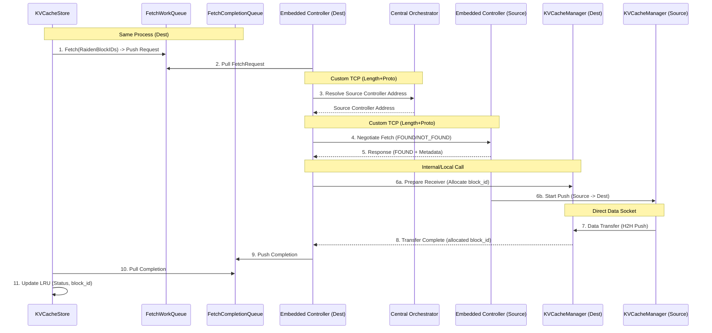

# Implementation Plan (v3): Remote KV Cache Fetching & Embedded C++ Control Plane

This document outlines the revised architectural design and step-by-step implementation plan for enabling remote KV cache fetching using an embedded C++ control plane and a central orchestrator, utilizing **Custom TCP Socket RPCs** for control communication.

---

## 🏗️ Architectural Overview

We are moving the control plane logic from external Python processes into embedded C++ threads within the Workers. Communication between the storage logic (`KVCacheStore`) and the networking/transfer negotiation logic (`RaidenControllerEmbedded`) happens via in-memory **Work/Completion Queues** within the same process. A **Central Orchestrator** is used for registration and discovery of peers.

All control plane communications (Controller <-> Orchestrator, Controller <-> Controller, Controller <-> Worker) will use a **Custom TCP Socket Protocol** (4-byte length prefix + serialized Protobuf), matching the lightweight approach of the existing system.

### 🧩 Components & Responsibilities

1.  **Central `RaidenOrchestrator`** (New Standalone C++ Service):
    *   Acts as the Global Directory/Registry.
    *   Tracks all active `RaidenUnit`s (Raiden ID -> Physical Controller Address).
    *   Uses Custom TCP Socket listener to handle Registration/Resolution requests.

2.  **`KVCacheStore`** (Storage layer in Control Plane):
    *   Manages the local LRU cache of `RaidenBlockID`s.
    *   Initiates fetches by pushing to the **`FetchWorkQueue`**.
    *   Finalizes fetches by pulling from the **`FetchCompletionQueue`**.
    *   Exposes a dedicated **`Fetch`** function (asynchronous/non-blocking) for remote fetching.

3.  **Embedded `RaidenControllerEmbedded`** (New Background Thread in Control Plane):
    *   One instance per `KVCacheStore` (running in a background thread in the same process).
    *   Talks to the Central Orchestrator via Custom TCP to register local existence and discover peers.
    *   Pulls from `FetchWorkQueue` to negotiate transfers with remote controllers via Custom TCP.
    *   Pushes to `FetchCompletionQueue` when transfers finalize.

4.  **`KVCacheManager` / `KVCacheListener`** (Worker / Data Plane):
    *   `KVCacheListener` handles control commands via existing Custom TCP logic.
    *   `KVCacheManager` handles the physical allocation of host blocks.
    *   Executes the actual **H2H (Host-to-Host)** data transfer (Confirmed **PUSH** mode via `H2hWriteDirectAsync`).

---

## 📝 Detailed Workflow (The Lifecycle of a Fetch)

1.  **Trigger**: User calls `KVCacheStore::Fetch` with a list of `RaidenBlockID`s (Status: `REMOTE`).
2.  **Work Enqueue**: `KVCacheStore` pushes a Fetch Request into the **`FetchWorkQueue`**.
3.  **Peer Discovery**: The **Embedded `RaidenController`** (Destination) pulls the request. It connects via **Custom TCP** to the **Central `RaidenOrchestrator`** to resolve the address of the Source Controller handling that `RaidenID`.
4.  **Negotiation**: The Destination Controller connects via **Custom TCP** to the Source Controller and sends the fetch request.
    *   **Source Controller Checks**: Source Controller verifies if the `block_hash` still exists in its local `KVCacheStore` LRU.
    *   **Response**: Sends `FOUND` (with metadata) or `NOT_FOUND` back to Dest Controller.
5.  **Transfer Trigger (PUSH Mode)**: 
    *   If `FOUND`, Destination Controller instructs its local **Worker (`KVCacheManager`)** to prepare (allocate local `host_block_id`).
    *   Source Controller instructs its local **Worker** to initiate PUSH (`H2hWriteDirectAsync`) to Destination Worker.
6.  **Data Movement**: Source Worker PUSHes data directly to Destination Worker (H2H).
7.  **Completion Notification**: 
    *   Destination Worker finishes downloading and notifies its Embedded Controller (providing the new `host_block_id`).
8.  **Completion Enqueue**: Destination Controller pushes the completion event into the **`FetchCompletionQueue`**.
9.  **Cache Update**: `KVCacheStore` pulls from the **`FetchCompletionQueue`**, updates the block status from `REMOTE` to `HOST`/`HBM`, and fills in the `host_block_id`.

---

## 📊 Component Interaction Diagram (Custom TCP Control Plane)



---

## 📅 Implementation Phasing

### Phase 1: In-Memory Infrastructure (Queues & Contracts) ✅ **COMPLETED**
*   **Major Changes**:
    *   Implemented `ThreadSafeQueue` template in `kv_cache_store.h` using `absl::Mutex` and `absl::CondVar`.
    *   Defined `FetchRequest` and `FetchCompletion` types.
    *   Added `work_queue_` and `completion_queue_` to `KVCacheStore` with push/pop accessors.

### Phase 2: Central Orchestrator Development ✅ **COMPLETED**
*   **Major Changes**:
    *   Implemented `RaidenOrchestrator` in C++ with a custom TCP listener.
    *   Supports `COMMAND_REGISTER_WORK_UNIT` and `COMMAND_RESOLVE_CONTROLLER`.
    *   Maintains thread-safe in-memory mapping of `RaidenId` to Controller Address.

### Phase 3: Embedded Controller Implementation ✅ **COMPLETED**
*   **Major Changes**:
    *   Implemented `RaidenControllerEmbedded` running in background threads.
    *   Pulls from `FetchWorkQueue`, resolves peers via Orchestrator, and negotiates fetches.
    *   Added `COMMAND_NEGOTIATE_FETCH` to `raiden_service.proto`.
    *   Implemented PUSH trigger logic: Destination Controller negotiates with Source Controller, which then instructs its Local Worker to start transfer (`COMMAND_START_TRANSFER`).

### Phase 4: Worker (Manager/Listener) Adapter ✅ **COMPLETED**
*   **Status**: COMPLETED
*   **Major Changes**:
    *   Refactored `KVCacheManagerBase::PushKVCacheResharded` to support pure Host-to-Host transfer (skipping D2H) if `src_mem_type == MEMORY_TYPE_DRAM` or if running in CPU-only mode.
    *   Updated `RaidenControllerEmbedded` to set `src_mem_type = MEMORY_TYPE_DRAM` in `StartTransferRequest` when triggering local worker for remote fetches.
    *   Verified non-blocking behavior of `BlockTransport::Push` (uses background scheduler).
    *   Verified end-to-end data transfer in `QueueFlow` test using real Manager and Listener, ensuring data reaches destination buffer without HBM interaction.
    *   Added **`QueueFlowMultiLayerMultiShard`** test to verify correct handling of complex layouts (2 layers, 2 shards).
    *   Added **`QueueFlowConcurrent`** test to verify system stability under multiple back-to-back/concurrent fetch requests.

### Phase 5: KVCacheStore Integration ✅ **COMPLETED**
*   **Major Changes**:
    *   Implemented the asynchronous `FetchRemote` method in `KVCacheStore` returning a `FetchFuture`.
    *   Spawned background `RaidenControllerEmbedded` threads in `KVCacheStore` initialization.
    *   Implemented `CompletionPollerLoop` to continuously read from `fetch_completion_queue_`, resolving `FetchFuture` instances and updating LRU cache block status from `REMOTE` to `HOST` upon transfer completion.
    *   Verified entire remote fetch pipeline via both Python JAX tests and C++ unit tests.

---

## 🛠️ Key Bug Fixes & Learnings (Integration Phase)

During the integration and end-to-end testing phases (both Python and C++), the following major bugs were identified and fixed:

### 1. Decoupled Negotiation & Execution (LookupAndFetch Alignment)
*   **Issue**: Originally, negotiation and transfer execution were tightly coupled in a single step inside the controller. This did not align with the JAX LookupAndFetch pattern, where the orchestrator/JAX layer first performs a global lookup, and then explicitly decides whether to trigger the physical fetch.
*   **Fix**: Introduced a separate `COMMAND_EXECUTE_FETCH` command in `raiden_service.proto`. The controller now performs negotiation (`COMMAND_NEGOTIATE_FETCH`) first, returning found/missing statuses. The transfer is physically initiated only when `COMMAND_EXECUTE_FETCH` is received, which translates the request into `COMMAND_START_TRANSFER` and broadcasts it to the local worker listeners.

### 2. Suppression of Receiver Listener Completions
*   **Issue**: In JAX tests utilizing `KVCacheManagerWithTransfer` (the TPU-enabled manager subclass), the receiver side would download data successfully but never notify its controller of completion. This caused `FetchFuture::Await()` to hang indefinitely.
*   **Fix**: Found that `KVCacheManagerWithTransfer::OnBlocksReceived` was bypassing calling its base class `KVCacheManagerBase::OnBlocksReceived` if the received block was part of an active transfer tracker. Modified the class to unconditionally forward all block completion callbacks to the base class, ensuring `KVCacheListener` always fires the `COMMAND_TRANSFER_COMPLETED` RPC.

### 3. Global vs. Local Shard Indexing Mismatch
*   **Issue**: In multi-listener/multi-worker setups, each worker process manages its own set of local shards, numbering them `0, 1, ..., num_local_shards-1`. However, the fetch negotiation phase was scheduling transfers using the global shard index.
    *   For example, in a 2-worker setup with 1 shard per worker, Worker B manages local shard 0. But the controller scheduled it to receive global shard 1. When Worker B received the block, `GetBlockChunks` checked if the scheduled destination shard index matched its local shard index (`1 == 0`), which failed and aborted the transfer.
*   **Fix**: Updated `RaidenControllerEmbedded::NegotiateFetch` to track worker peer addresses and map each global shard index to its respective local shard index on the destination worker (using `peer_to_local_shard[peer_addr]++`). This allows seamless routing in both single-listener (e.g., 1 listener managing 2 shards) and multi-listener (e.g., 2 listeners each managing 1 shard) configurations.


### 4. Multi-Layer Progress Tracking in BlockTransport (Not Needed)
*   **Issue**: During multi-layer fetch integration testing, we noticed that when a transfer was triggered with `layer_idx = -1` (all layers), the transport receiver only tracked progress for Layer 0, causing the receiver manager to hang during shutdown waiting for pending H2D transfers.
*   **Resolution**: We determined that **multi-layer progress tracking in the transport is not needed** for the remote fetch design. The aligned design specifies that the remote fetch operation *only* performs Host-to-Host (H2H) network transfers into host staging memory (`dst_mem_type = MEMORY_TYPE_DRAM`). Because H2D is skipped during the automatic transfer, no active plan trackers are registered, avoiding the shutdown hang. The client (JAX) manually triggers `h2d()` copies later when it needs the data in HBM. We updated the embedded controller to explicitly use `MEMORY_TYPE_DRAM` for fetches.

---

## 📅 Future Work: Phase 6 — Remote Fetch Write-Through (Registry Update)

### 1. Objective
Currently, the `GlobalRegistry` stores a single owner (`host_address` string) for each `prefix_hash`. During global fallback lookups, `KVCacheStore` abuses `RaidenId::job_name` to store this IP:port address because it lacks a proper `RaidenId` representation. This bypasses the Orchestrator's routing control plane and breaks `ResolveRemoteController` resolution.

To fix this, we will update the `GlobalRegistry` to store **`RaidenId`** instead of `host_address` in its metadata. Once a remote fetch completes successfully, the destination worker will register its own `RaidenId` as an owner in the registry.

This enables:
*   **Multi-owner tracking**: Registry knows all `RaidenId` instances replicating a block.
*   **Decoupled metadata and routing**: Registry stores *logical* owner (`RaidenId`), while `RaidenOrchestrator` stores *physical* routing (`RaidenId` -> IP:port).
*   **Resilient eviction**: If one owner evicts and unregisters, other owners remain valid.

### 2. Design Plan

#### A. Proto Changes (`global_registry.proto`)
*   Import `third_party/tpu_raiden/tpu_raiden/rpc/raiden_service.proto`.
*   Update `KVBlockMetadata` to use `RaidenIdProto` instead of `host_address`:
    ```protobuf
    message KVBlockMetadata {
      RaidenIdProto raiden_id = 1;
      int32 block_id = 2;
    }
    ```
*   Update `UnregisterRequest` to take `RaidenIdProto` instead of `host_address`:
    ```protobuf
    message UnregisterRequest {
      repeated string prefix_hashes = 1;
      RaidenIdProto raiden_id = 2;
    }
    ```

#### B. Global Registry C++ Service Enhancements
*   **Data Structure**: In `GlobalRegistryServiceImpl` (`global_registry_server.h`), change the internal registry storage to use `RaidenId` and support multiple entries:
    ```cpp
    struct RegistryEntry {
      RaidenId raiden_id;
      int32_t block_id;
      absl::Time expire_time;
    };

    // Key: prefix_hash
    // Value: list of active registration entries
    absl::flat_hash_map<std::string, std::vector<RegistryEntry>> registry_
    ```
*   **`Register` RPC**:
    *   For each incoming entry, check if the `raiden_id` is already in the vector.
    *   If yes, update `block_id` and `expire_time`.
    *   If no, append the new `RegistryEntry` to the vector.
*   **`Lookup` RPC**:
    *   Find the vector of entries. Filter out expired ones.
    *   If multiple valid entries exist, return one in a **round-robin** fashion across calls for that hash (tracking last returned index per hash in server memory) in `LookupResponse` (single owner returned to maintain 1-to-1 sequential mapping).
*   **`Unregister` RPC**:
    *   Remove the entry matching the requested `raiden_id` from the vector.
    *   If the vector is empty, erase the hash key.

#### C. KVCacheStore Integration
*   **Remove job_name Abuse in Lookup**:
    *   In `KVCacheStore::Lookup` (`kv_cache_store.cc`), map the returned `RaidenIdProto` from registry directly to `RaidenId` in `results` (no longer setting `remote_id.job_name = metadata.host_address()`).
*   **Write-Through on Fetch Completion (Non-Blocking)**:
    *   In `KVCacheStore::CompletionPollerLoop` (`kv_cache_store.cc`), when a fetch completes successfully:
        *   Trigger an asynchronous, non-blocking call to `registry_client_->Register(...)` to register `raiden_id_` and the allocated local `host_block_id` for that `block_hash`.
        *   To do this safely without blocking the poller thread and avoiding lifetime issues if the store is destroyed, change `registry_client_` in `KVCacheStore` to `std::shared_ptr<GlobalRegistryClient>` and capture it in a detached helper thread (or use a thread pool) executing the call.

#### D. Verification & Testing
*   **Registry Unit Tests**: Update `global_registry_test.cc` to use `RaidenId` in registration and verify multiple owner scenarios.
*   **E2E Integration Test**: Add a test in `kv_cache_store_test.cc` where Worker B fetches a block from Worker A, and verify that both `id1` and `id2` are registered as owners for that hash in the registry.
