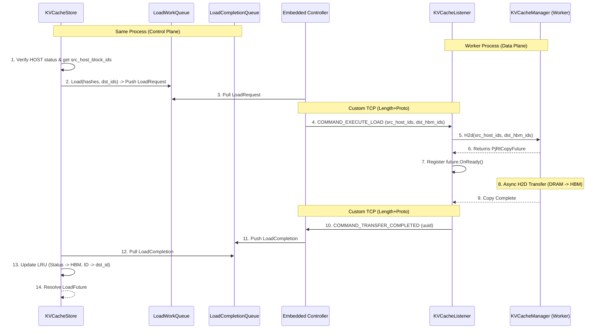

# Implementation Plan: Remote KV Cache Load (H2D)

This document outlines the design and step-by-step implementation plan for adding a `Load` API to `KVCacheStore` to copy cache blocks from host RAM (DRAM) to device memory (HBM).

---

## 🏗️ Architectural Overview

The `Load` feature will allow JAX/Torch schedulers to copy fetched cache blocks into the device's HBM pool before execution. It reuses the existing embedded C++ control plane structures (`RaidenControllerEmbedded` and `KVCacheListener`).

Unlike `FetchRemote`, `Load` only involves **local** host-to-device (H2D) copies on the worker nodes that already hold the blocks in DRAM. No cross-host network transfers or central orchestrator lookups are required.

---

## 📝 Workflow (The Lifecycle of a Load)

1.  **Trigger**: User calls `KVCacheStore::Load(block_hashes, dst_hbm_block_ids)`.
2.  **Local Check & Pinned Verification**:
    *   `KVCacheStore` checks the local LRU cache.
    *   Blocks must be present locally and have `BlockStatus::HOST` status.
    *   If a block is valid, `KVCacheStore` retrieves its `BlockSliceList` (containing `RaidenBlockID` per shard, which provides the source `host_block_id`).
    *   Invalid blocks (not found or not in `HOST` status) are immediately marked as failed in their respective `LoadFuture`.
3.  **Work Enqueue**: For valid blocks, `KVCacheStore` groups the H2D copies into a `LoadRequest` and pushes it to the **`LoadWorkQueue`**.
4.  **Dispatch**: `RaidenControllerEmbedded` pulls the `LoadRequest`. Since it manages multiple local workers, it groups the load entries by local worker peer address and sends a `COMMAND_EXECUTE_LOAD` control request to each local **`KVCacheListener`**.
5.  **Execution (H2D)**: The worker listener receives `COMMAND_EXECUTE_LOAD`, extracts the `src_host_block_id` and `dst_hbm_block_id` mappings, and calls the worker's **`KVCacheManagerBase::H2d`** API.
6.  **Async Tracking**: `KVCacheManagerBase::H2d` performs the H2D transfer asynchronously and returns a `PjRtCopyFuture`. The listener registers an `OnReady` callback on this future.
7.  **Completion Notification**: When the async copy completes, the listener's callback sends a `COMMAND_TRANSFER_COMPLETED` RPC (reusing the fetch completion signal) back to the embedded controller.
8.  **Completion Enqueue**: When the controller receives completion signals from all workers for a specific `load_id`, it pushes a completion event to the **`LoadCompletionQueue`**.
9.  **Cache Directory Update**: `KVCacheStore::CompletionPollerLoop` pulls from `LoadCompletionQueue`, updates the block status in the LRU cache from `HOST` to `HBM`, and sets the block ID to the destination HBM block ID (`dst_hbm_block_id`).
10. **Future Resolution**: `KVCacheStore` marks the pending `LoadFuture` as completed.

---

## 📊 Component Interaction Diagram

---

## 📅 Implementation Phasing

### Phase 1: Protobuf & Queue Infrastructure
*   Update `raiden_service.proto` to:
    *   Add `COMMAND_EXECUTE_LOAD` to `ControlRequest::Command`.
    *   Define `LoadRequest` and `LoadCompletion` messages if needed, or expand `StartTransferRequest` and `ControlRequest` fields to carry load mappings (`src_host_block_ids` -> `dst_hbm_block_ids` per shard).
*   Add `LoadWorkQueue` and `LoadCompletionQueue` to `kv_cache_store.h`.

### Phase 2: KVCacheStore API Implementation
*   Define `LoadState` and `LoadFuture` in `kv_cache_store.h` (analogous to `FetchState` and `FetchFuture`).
*   Implement `KVCacheStore::Load` to validate blocks against LRU and push requests.
*   Implement `KVCacheStore::PollLoadStatus`.
*   Extend `KVCacheStore::CompletionPollerLoop` to poll `load_completion_queue_` and transition block status to `HBM`.

### Phase 3: Controller Dispatch & Listener Execution
*   Update `RaidenControllerEmbedded` to handle `LoadRequest`, group entries by worker, and dispatch `COMMAND_EXECUTE_LOAD`.
*   Update `KVCacheListener` to handle `COMMAND_EXECUTE_LOAD`, trigger `engine_->H2d()`, and send back `COMMAND_TRANSFER_COMPLETED` upon `PjRtCopyFuture` readiness.

### Phase 4: Verification
*   Add E2E tests in `kv_cache_store_test.cc` to verify:
    *   Load of single and multiple blocks.
    *   Handling of invalid/missing blocks (immediate failure).
    *   LRU status transition verification (`HOST` -> `HBM`).
    *   JAX/Torch Python API binding updates and tests.
