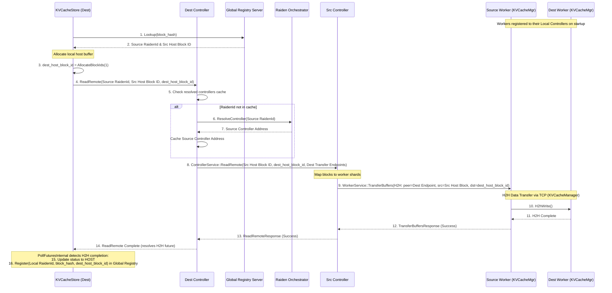

# Implementation Plan (v5): Remote KV Cache Reading via Controller-to-Controller gRPC & H2H TCP Transfer

This document outlines the architectural design and workflow for remote KV cache reading (formerly FetchRemote) using the `RaidenControllerService` and `WorkerService` for control-plane gRPC, while maintaining `KVCacheManager`'s H2H (Host-to-Host) TCP API for the data-plane payload transfer.

---

## 🏗️ Architectural Overview & The "New" Pattern

The previous custom TCP socket (`RaidenControllerEmbedded` & `KVCacheListener`) control plane is replaced entirely by gRPC, but the high-performance raw data transport remains via TCP sockets.

1. **Worker Layer (TPU VM)**: 
   * Runs `WorkerServiceServer` (for gRPC control) and `KVCacheManager` (for TCP data transfer via `BlockTransport`).
   * **Registration**: Upon startup, Workers register themselves as clients to the central `RaidenControllerService` (via `RegisterWorker`), providing both their `raiden_worker_endpoint` (gRPC) and `raiden_transfer_endpoint` (TCP Data).
2. **Controller Layer (JAX Host)**: 
   * Runs `KVCacheStore` and the new `RaidenController` / `RaidenControllerService`.
   * The Controller manages the `LogicalBlockManager` (all buffer handles are pre-allocated across workers in advance).
3. **Global Orchestrator Layer**: 
   * `GlobalRegistry` tracks the mapping of `prefix_hash` to the logical `RaidenId` allowing global cache discovery across disparate JAX jobs.
   * `RaidenOrchestrator` tracks the mapping of `RaidenId` -> `ControllerService IP:Port`, enabling controllers to mutually discover one another over the network.

---

## 1️⃣ Key Corrections & Design Principles

**A. Distributed gRPC Control Plane**
The entire control plane will rely on gRPC for robust, structured communication endpoints:
- `ControllerService`: (Controller-to-Controller) Allows controllers to communicate with each other globally.
- `WorkerService`: (Controller-to-Worker) Allows controllers to dispatch commands to their local worker shards.
- `OrchestratorService`: (Controller-to-Orchestrator) Upgrades the old custom TCP orchestrator for registration and discovery over gRPC.

**B. Data Transfer is H2H (Not gRPC)**
We do *not* stream multi-gigabyte KV tensors over gRPC. `WorkerService` is strictly a control-plane interface to trigger execution. The actual large data payload is explicitly transferred using `KVCacheManager`'s raw `H2hWriteDirectAsync` API over standard TCP sockets (the `raiden_transfer_endpoint`).

**C. Pre-Allocation and Source Discovery**
*   **Source Discovery**: The destination controller obtains the `src_host_block_ids` (and the owner's `RaidenId`) by calling `GlobalRegistryClient::Lookup()`, which returns `KVBlockMetadata` (defined in [global_registry.proto](file:///google/src/cloud/jcgu/raiden_controller/google3/third_party/tpu_raiden/tpu_raiden/kv_cache/global_registry/global_registry.proto#L36-L43)) containing the `block_id` (representing the source's host block ID) and `raiden_id`.
*   **Host Block ID Registration**: When `KVCacheStore` registers its blocks (via `Register`) upon Save or ReadRemote completion, it includes the local host block ID in the `block_id` field of the registration metadata. Thus, `block_id` in `GlobalRegistry` always represents the host block ID on the owner node.
*   **Pre-pinning in LRU (External to ReadRemote)**: Before calling `ReadRemote`, the caller (e.g. the JAX/Torch framework layer) must insert these remote blocks into the local `KVCacheStore`'s LRU cache and pin them (using `InsertAndLock` with status `REMOTE` and the remote `host_block_id` as the source ID). This reserves the slots and prevents eviction during the transfer. This step is *not* performed by `KVCacheStore::ReadRemote` itself.
*   **Pre-Allocation**: Inside `ReadRemote`, `KVCacheStore` allocates local destination host block IDs using its `AllocateBlockIds` API. It updates the LRU entries with these new local `dest_host_block_ids`, while keeping the `src_host_block_ids` in memory for the transfer. It then passes these local and remote IDs (along with destination peer endpoints) to `RaidenController::ReadRemote()`.

**D. Host Buffer Management (Dual-Allocation)**
The Controller (specifically `KVCacheStore`) acts as the master source of truth for host memory, dictating placement by allocating a `dest_host_block_id` via its local LRU cache. The receiving worker blindly accepts this ID and writes directly to it (via H2H target registration), entirely bypassing the worker-side block management.

**E. Asynchronous Remote Read in KVCacheStore (H2H Only)**
`KVCacheStore::ReadRemote` will support H2H (remote host to local host) transfer only and is fully asynchronous.
1. It expects the requested block hashes to already exist in the LRU cache with status `REMOTE` and to be **pinned**.
2. It verifies that none of the requested hashes are already being read (using `reading_hashes_` set) to prevent concurrent duplicate reads.
3. It allocates local host blocks, updates the LRU entries, and triggers the H2H transfer asynchronously via `RaidenController::ReadRemote()`, returning a future immediately.
4. The active transfer is tracked in `active_remote_reads_`.
5. In `KVCacheStore::PollFuturesInternal` (using the existing background poller thread), we poll for H2H completion.
6. Once the H2H transfer completes successfully, we update the block status to `HOST` in the LRU cache (the blocks remain pinned until released by the caller), register the new mapping in the `GlobalRegistry` via `KVCacheStore`'s write-through pool, and remove the hashes from `reading_hashes_`.
7. If the transfer fails, we deallocate the allocated local `dest_host_block_ids`, remove the hashes from `reading_hashes_`, and move them to `failed_remote_reads_`. The frontend caller (upon detecting failure via `poll_remote_read_status()`) is responsible for calling `ReleaseAndDelete` to safely unpin, erase from LRU, and restore any evicted candidates.

---

## 2️⃣ Major Implementation Pieces

### A. Use Existing `WorkerService::TransferBuffers` for H2H
We will use the existing `TransferBuffers` RPC in `WorkerService` to trigger the H2H transfer.
*   `rpc TransferBuffers(TransferBuffersRequest) returns (TransferBuffersResponse)`
*   To trigger H2H, the `TransferBufferSpec` will be populated with:
    *   `src_mem_type = MEMORY_TYPE_DRAM`
    *   `dst_mem_type = MEMORY_TYPE_DRAM`
    *   `peer = [destination_worker_transfer_endpoint]`
    *   `src_offsets = [source_host_block_ids]`
    *   `dst_offsets = [dest_host_block_ids]`

### B. Migrate `RaidenOrchestrator` to gRPC (`orchestrator_service.proto`) [✅ COMPLETED]
*   Create a new proto defining `OrchestratorService` with two key RPCs:
    *   `rpc RegisterController(RegisterControllerRequest) returns (RegisterControllerResponse)`
    *   `rpc ResolveController(ResolveControllerRequest) returns (ResolveControllerResponse)`
*   Refactor `RaidenOrchestrator` native C++ code to launch a gRPC server and remove custom socket management.

### C. Controller `ReadRemote` Implementation
*   Add an RPC to `ControllerService` (`controller_service.proto`) allowing a peer Controller to request a block:
    *   `rpc ReadRemote(ReadRemoteRequest) returns (ReadRemoteResponse)`
        *   Request contains: `src_host_block_ids`, `dest_host_block_ids`, `dest_worker_endpoints` (TCP transfer endpoints of destination workers, **sorted based on their `worker_id` ascending**).
*   Implement asynchronous `RaidenController::ReadRemote`:
    ```cpp
    tsl::Future<> ReadRemote(const RaidenId& src_raiden_id,
                             const std::vector<int32_t>& src_host_block_ids,
                             const std::vector<int32_t>& dest_host_block_ids);
    ```
    1. Retrieve the local registered workers' `raiden_transfer_endpoint`s from `worker_registry_`, sorted deterministically by `worker_id` (ascending).
    2. Resolve the source `RaidenId`'s controller address. First check the local cache `resolved_controllers_` (mapping `RaidenId -> ControllerAddress`). If not found, query `RaidenOrchestrator` via `ResolveController` and cache the result.
    3. Send the `ReadRemote` gRPC request to the resolved Source Controller, passing the `src_host_block_ids`, `dest_host_block_ids`, and the sorted list of local (destination) workers' `raiden_transfer_endpoints` (as `dest_worker_endpoints` in the request, ensuring they are ordered by destination `worker_id` ascending).
    4. The Source Controller receives the RPC:
       - Retrieves its own local registered workers, sorted deterministically by `worker_id` (using numerical sorting if `worker_id` is named `worker_N` to avoid alphabetical order bugs like `worker_10` before `worker_2`, ensuring 1-to-1 shard alignment with the destination workers).
       - Verifies that the number of local workers matches the number of `dest_worker_endpoints` in the request.
       - Calls the updated broadcast `RaidenController::TransferBuffers` API (see Step 3.5 below), passing the `dest_worker_endpoints` list as the `peers` parameter.
    5. Return a `tsl::Future<>` that resolves when all workers complete the H2H transfer (meaning the peer controller can respond).


### D. KVCacheStore Refactoring (ReadRemote H2H Only)
Implement `KVCacheStore::ReadRemote` to handle remote block fetching:
```cpp
absl::Status ReadRemote(const std::vector<std::string>& block_hashes);
```
*Note: Exposed to Python API as `read_remote(block_hashes) -> bool` which returns `True` if successfully launched, `False` if early validation or allocation failed.*

1. It verifies that all `block_hashes` exist in the LRU cache with status `REMOTE` and are pinned. If not, returns `absl::InvalidArgumentError` (latching to `False` in Python).
2. It verifies that none of the `block_hashes` are already in `reading_hashes_` (returning `absl::FailedPreconditionError` if so) and inserts them into `reading_hashes_`.
3. It extracts the `src_raiden_id` and `src_host_block_id` (currently stored in the LRU entry's `host_block_id` field) for each hash.
4. It attempts to allocate local `dest_host_block_ids` using `AllocateBlockIds` (which may trigger proactive eviction of other blocks).
   - **Abort on Allocation Failure**: If `AllocateBlockIds` fails (returns error), `ReadRemote` will print a warning log, abort the entire transfer immediately (no partial transfer), clean up any modifications, and return the error status (latching to `False` in Python).
5. It updates the LRU entries with the new local `dest_host_block_ids`.
6. It groups the request by source `RaidenId` and triggers `RaidenController::ReadRemote(...)` for each group, passing the corresponding `src_host_block_ids` and `dest_host_block_ids`.
7. It combines the futures and adds the combined future to `active_remote_reads_` (mapping future to state).
8. In `KVCacheStore::PollFuturesInternal` (using the existing background poller thread):
   - When a remote read future is ready:
     - Remove the hashes from `reading_hashes_`.
     - If successful:
       - Update the block status to `HOST` in the LRU cache (remains pinned).
       - Register the new local block in the `GlobalRegistry` via the write-through pool.
       - Move hashes to `done_remote_reads_`.
     - If failed:
       - Deallocate the local `dest_host_block_ids` (via `DeallocateBlockIds`).
       - Move hashes to `failed_remote_reads_`.
9. Expose `PollRemoteReadStatus` to poll completed/failed reads:
   ```cpp
   std::tuple<std::vector<std::string>, std::vector<std::string>, std::vector<std::string>>
   PollRemoteReadStatus();
   ```
   Expose this method via Pybind to Python wrappers. The frontend caller is responsible for querying this status. If a failure is detected, the caller MUST call `ReleaseAndDelete(hashes)` to safely unpin, delete, and restore candidates.


## 📊 Workflow Sequence Diagram (PUSH Model via H2H)



---

## 🛠️ Step-by-Step Implementation Plan

### Step 1: Migrate RaidenOrchestrator to gRPC [✅ COMPLETED]

### Step 1.5: Integrate ControllerService into RaidenController [✅ COMPLETED]

### Step 2: RaidenController Registration & Resolution Flow [✅ COMPLETED]

### Step 2.5: Register Workers to RaidenController [✅ COMPLETED]

### Step 3: Implement `ReadRemote` on `ControllerService`
*   **To-Do**: Add `ReadRemote` RPC definition in `controller_service.proto`.
*   **To-Do**: Implement the handler within `RaidenControllerServiceImpl` (which resolves local worker shards and triggers `TransferBuffers` H2H to the destination).
*   **To-Do**: Implement `RaidenController::ReadRemote` client method to call the peer controller, including caching resolved controller addresses in `resolved_controllers_`.

### Step 3.5: Update `RaidenController::TransferBuffers` Broadcast API
*   **To-Do**: Update `RaidenController::TransferBuffers` broadcast signature in `raiden_controller.h`/`.cc` to accept `absl::Span<const std::string> peers` instead of `absl::string_view peer`.
*   **To-Do**: Update its implementation to:
    1. Retrieve registered workers from `worker_registry_`.
    2. Sort the workers by `worker_id` to ensure deterministic ordering.
    3. Loop over the sorted workers, match them 1-to-1 with `peers[i]`, and trigger `TransferBuffers` on each worker client.
    4. Combine the futures.

### Step 4: Verify and Ensure Worker-Side H2H Support
*   **To-Do**: Ensure `WorkerServiceImpl::TransferBuffers` correctly routes H2H requests with peer addresses to `KVCacheManager::H2hWrite`.
*   **To-Do**: Add a unit test in `worker_service_test.cc` to verify `TransferBuffers` with H2H type works.

### Step 5: Implement `KVCacheStore::ReadRemote` & Poll Support (H2H Only)
*   **To-Do**: Implement `KVCacheStore::ReadRemote` method to allocate host blocks, trigger `RaidenController::ReadRemote`, and track active reads.
*   **To-Do**: Add `active_remote_reads_` to track pending H2H transfers.
*   **To-Do**: Update `KVCacheStore::PollFuturesInternal` to poll these futures. Upon completion, update status to `HOST` in the LRU cache and register in the `GlobalRegistry`.
*   **To-Do**: Add unit tests in `kv_cache_store_test.cc` to verify `ReadRemote` H2H transfer and registry registration.

---

## 🧪 Verification & Testing Plan

### A. C++ Unit Tests (`third_party/tpu_raiden/tpu_raiden/kv_cache/kv_cache_store_test.cc`)

1.  **`ReadRemoteSuccess`**:
    *   **Setup**:
        *   Launch a mock registry server (`global_registry::GlobalRegistryServiceImpl`).
        *   Initialize `KVCacheStore` (Dest) and mock `RaidenController`.
        *   Insert and pin a `REMOTE` slice for `hash_0` pointing to source `RaidenId("src_job", "0", "cache", 0)` and `src_host_block_id = 42`.
    *   **Action**: Call `store.ReadRemote({"hash_0"})`.
    *   **Verification**:
        *   Verify that `AllocateBlockIds` was called on the local controller to allocate a local `dest_host_block_id` (e.g. `0`).
        *   Verify that the LRU entry for `hash_0` is updated to have `host_block_id = 0` and status `REMOTE`.
        *   Verify that `RaidenController::ReadRemote` was called with the correct parameters: `src_raiden_id`, `src_host_block_ids = {42}`, and `dest_host_block_ids = {0}`.
        *   Simulate H2H completion (resolve the mock controller future).
        *   Call `PollFuturesInternal` (or wait/poll for it).
        *   Verify that the block status in LRU is updated to `HOST`.
        *   Verify that the block is registered in the global registry with `block_id = 0` (local host block ID).

2.  **`ReadRemoteFailure`**:
    *   **Setup**: Same as above, but mock the controller to return a failed future for `ReadRemote`.
    *   **Action**: Call `store.ReadRemote({"hash_0"})` and wait/poll.
    *   **Verification**:
        *   Verify that `PollFuturesInternal` detects the failure.
        *   Verify that the block is unpinned and deleted from the LRU cache.
        *   Verify that any evicted candidates (if any were evicted during allocation) are restored.

3.  **`ReadRemoteMultipleSources`**:
    *   **Setup**:
        *   Insert and pin two remote blocks: `hash_0` (from `src_1`, `src_host_id = 10`) and `hash_1` (from `src_2`, `src_host_id = 20`).
    *   **Action**: Call `store.ReadRemote({"hash_0", "hash_1"})`.
    *   **Verification**:
        *   Verify that it groups the transfers and makes two separate async calls to `RaidenController::ReadRemote`, one for each source controller.
        *   Verify that it combines the futures and both must complete before updating status in LRU.

---

### B. Python E2E Tests (`third_party/tpu_raiden/tpu_raiden/api/jax/kv_cache_store_e2e_test.py`)

We will add a new E2E test `test_remote_read_e2e` to verify the complete H2H data transfer and byte-exact correctness.

**Test Setup & Execution Flow**:
1.  **Orchestration Setup**:
    *   Start a Mock Global Registry on a free port.
    *   Start a Mock Orchestrator on a free port.
2.  **Initialize Source (Job A)**:
    *   Create `KVCacheStore` for `RaidenId("job_a", "0", "cache", 0)` (Controller A) pointing to registry and orchestrator.
    *   Create `KVCacheManager` for Job A (Worker A).
    *   Generate random cache data `host_data_A` (e.g. using `jax.random` or `np.random` to assign total random values to elements in the JAX array, ensuring high entropy) and load it to `tpu_cache_A` on TPU.
    *   Insert `hash_0` as `HBM` block in Controller A.
    *   Call `Save({"hash_0"})` to transfer it to Host A's buffer (updates status to `HOST_AND_HBM` and registers `hash_0` -> `job_a` & `block_id = 0` in the global registry).
3.  **Initialize Destination (Job B)**:
    *   Create `KVCacheStore` for `RaidenId("job_b", "0", "cache", 0)` (Controller B).
    *   Create `KVCacheManager` for Job B (Worker B), with its local TPU cache initialized to zeros.
4.  **Lookup & Remote Read**:
    *   Controller B calls `Lookup({"hash_0"}, enable_global=true)`.
    *   Verify it returns `hash_0` with status `REMOTE`, owner `job_a`, and `host_block_id = 0` (the source host block ID).
    *   Controller B calls `InsertAndLock` with this remote slice (inserts into LRU as `REMOTE` and pins it).
    *   Controller B calls `ReadRemote({"hash_0"})`.
    *   Wait/poll for `ReadRemote` completion.
    *   Verify status of `hash_0` in Controller B becomes `HOST`, and it is registered in the global registry under `job_b`.
5.  **Local Load & Verification**:
    *   Controller B calls `Load({"hash_0"}, [target_device_block_id])` to transfer the data from Worker B's host buffer to Worker B's TPU cache.
    *   Wait/poll for `Load` completion.
    *   Read the TPU cache of Worker B and verify it contains **byte-exact** same random data as `host_data_A` (using `np.testing.assert_array_equal` to ensure byte-exact match).
6.  **NUMA Support**:
    *   Run the E2E test with both `ENABLE_MULTI_NUMA=0` and `ENABLE_MULTI_NUMA=1` to ensure correct shard mapping on the source and destination workers.
