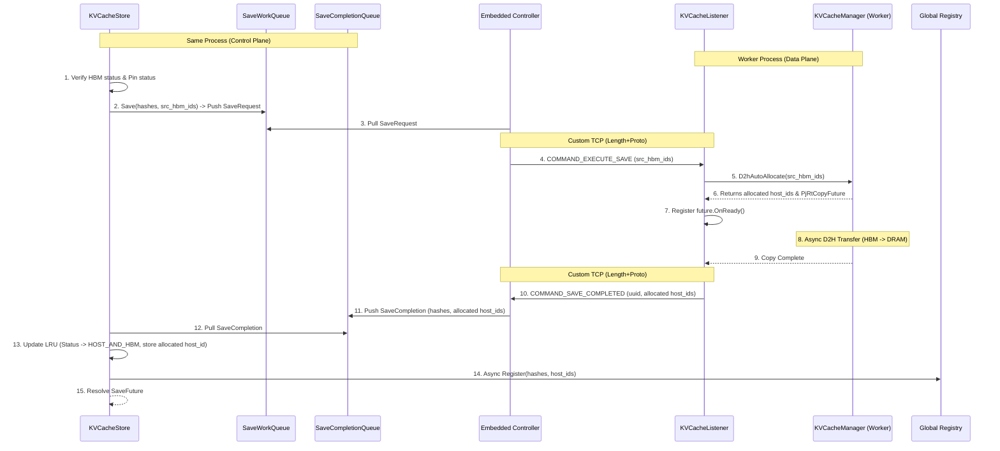

# Implementation Plan: Remote KV Cache Save (D2H)

This document outlines the design and step-by-step implementation plan for adding a `Save` API to `KVCacheStore` to copy cache blocks from device memory (HBM) to host RAM (DRAM).

---

## 🏗️ Architectural Overview

The `Save` feature will allow JAX/Torch schedulers to offload cache blocks from device HBM to host RAM (DRAM) when device memory is pressured, and later load them back if needed. It executes Device-to-Host (D2H) copies in the dataplane.

It reuses the existing embedded C++ control plane structures (`RaidenControllerEmbedded` and `KVCacheListener`) and follows a similar async pattern to `Load` (H2D).

Unlike `Load`, the destination host block IDs are not pre-allocated by the scheduler. Instead, they are dynamically allocated by the worker during the D2H operation and propagated back to the control plane.

Once offloaded to host RAM, the block is registered in the global registry so that other nodes can locate and fetch it.

---

## 📝 Workflow (The Lifecycle of a Save)

1.  **Trigger**: User calls `KVCacheStore::Save(block_hashes, src_hbm_block_ids)`.
2.  **Local Check & Pinned Verification**:
    *   `KVCacheStore` checks the local LRU cache.
    *   Blocks must be present locally and have `BlockStatus::HBM` status, and must be pinned.
    *   Invalid blocks (not found, not in `HBM` status, or not pinned) are immediately marked as failed in their respective `SaveFuture`.
3.  **Work Enqueue**: For valid blocks, `KVCacheStore` groups the D2H copies into a `SaveRequest` and pushes it to the **`SaveWorkQueue`**.
    *   *Note: `SaveRequest` only contains `src_block_ids` (HBM).*
4.  **Dispatch**: `RaidenControllerEmbedded` pulls the `SaveRequest`, groups the entries by local worker peer address, and sends a `COMMAND_EXECUTE_SAVE` control request to each local **`KVCacheListener`**.
5.  **Execution (D2H with Auto-Allocation)**: The worker listener receives `COMMAND_EXECUTE_SAVE`, extracts the `src_hbm_block_id` mappings, and calls the worker's **`KVCacheManagerBase::D2hAutoAllocate`** API.
6.  **Async Tracking & Allocation**: `KVCacheManagerBase::D2hAutoAllocate` allocates host blocks, performs the D2H transfer asynchronously, and returns the allocated `host_block_ids` and a `PjRtCopyFuture`.
7.  **Completion Notification**: When the async copy completes, the listener's callback sends a `COMMAND_SAVE_COMPLETED` RPC back to the embedded controller, carrying the allocated **`host_block_ids`**.
8.  **Completion Enqueue**: When the controller receives completion signals from all workers for a specific `save_id`, it maps the allocated `host_block_ids` back to the corresponding block hashes and pushes a completion event to the **`SaveCompletionQueue`**.
9.  **Cache Directory Update**: `KVCacheStore::SaveCompletionPollerLoop` pulls from `SaveCompletionQueue`, updates the block status in the LRU cache from `HBM` to `HOST_AND_HBM`, and stores the allocated `host_block_id` in the `RaidenBlockID`.
10. **Global Registration**: `KVCacheStore` asynchronously registers the saved blocks in the **Global Registry** with their allocated `host_block_ids`.
11. **Future Resolution**: `KVCacheStore` marks the pending `SaveFuture` as completed.

---

## 📊 Component Interaction Diagram

---

## 📅 Implementation Phasing

### Phase 1: Protobuf & Structure Updates
*   Update `raiden_service.proto`:
    *   Add `COMMAND_EXECUTE_SAVE` and `COMMAND_SAVE_COMPLETED` to `ControlRequest::Command`.
    *   Define `SaveRequest` (only needs `src_block_id` in shard entries).
    *   `ControlRequest` needs to support carrying allocated `host_block_ids` in `COMMAND_SAVE_COMPLETED` (can reuse `completed_block_ids` field).
*   Extend `RaidenBlockID` in `kv_cache_store.h` to have both `host_block_id` and `hbm_block_id`.
*   Update `LoadCompletion` handling in `kv_cache_store.cc` to use `hbm_block_id` instead of overwriting `host_block_id`.

### Phase 2: KVCacheStore API Implementation
*   Define `SaveState` and `SaveFuture` in `kv_cache_store.h`.
*   Add `SaveWorkQueue` and `SaveCompletionQueue` to `KVCacheStore`.
*   Implement `KVCacheStore::Save` to validate blocks (must be `HBM` and pinned) and enqueue request.
    *   *Signature: `Save(block_hashes, src_hbm_block_ids)`*
*   Implement `KVCacheStore::PollSaveStatus`.
*   Implement `KVCacheStore::SaveCompletionPollerLoop` to transition status to `HOST_AND_HBM`, store the allocated host block ID, and register the blocks in the Global Registry.

### Phase 3: Controller Dispatch & Listener Execution
*   Update `RaidenControllerEmbedded` to handle `SaveRequest` and dispatch `COMMAND_EXECUTE_SAVE`.
*   Update `KVCacheListener` to handle `COMMAND_EXECUTE_SAVE`:
    *   Call `KVCacheManagerBase::D2hAutoAllocate`.
    *   In `OnReady` callback, send `COMMAND_SAVE_COMPLETED` back to controller, passing the allocated host block IDs.
*   Update `RaidenControllerEmbedded::HandleSaveCompletionFromWorker` to receive the allocated IDs, map them back to block hashes, and push to store.

### Phase 4: Python Bindings & Verification
*   Expose `Save` (without `dst_host_block_ids`) and `PollSaveStatus` in nanobind JAX module.
*   Expose `SaveFuture` and update Python wrapper in `api/jax/kv_cache_store.py`.
*   Add C++ and Python unit tests to verify the D2H flow with auto-allocation and registration.
